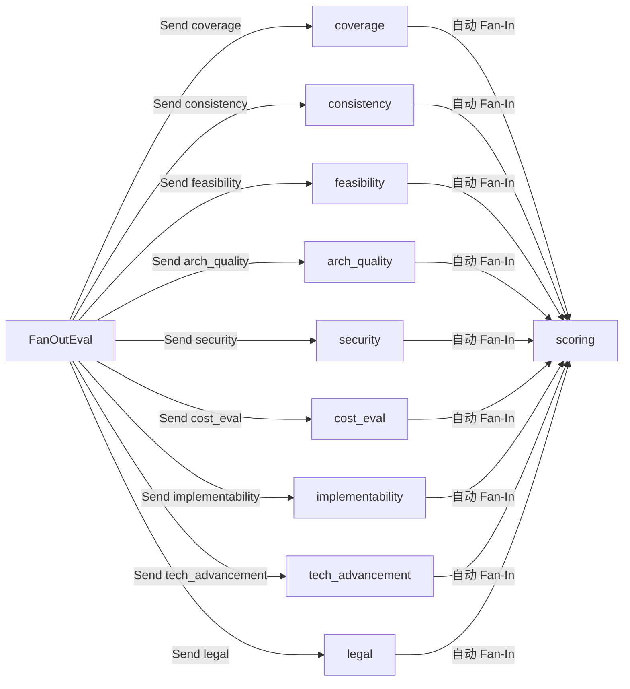
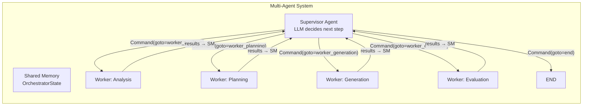

# 块 G：LangGraph 高级模式增强

> **关联文档**：`block-C-agent-pipeline.md`（4 层 Agent Layer）、`block-D-orchestration.md`（主编排）
>
> **目标**：将当前基础的线性 StateGraph 升级为原生 LangGraph 高级模式——并行扇出、Command 路由、原生子图、生产级持久化、Time-Travel 调试、Multi-Agent 编排。

---

## 1. 当前现状总览

| LangGraph 特性 | 当前状态 | 说明 |
|----------------|---------|------|
| **add_node + add_edge** | ✅ 大量使用 | 全部是线性链 |
| **add_conditional_edges** | ✅ Orchestrator 主图 | needs_review / IterationDecider |
| **interrupt** | ✅ HumanReviewNode | 人工审核中断 |
| **MemorySaver checkpointer** | ⚠️ 可选启用 | 仅 orchestrator 主图 |
| **Annotated reducer** | ✅ 刚引入 | dimension_scores / section_contents |
| **`Send()` 并行扇出** | ❌ 未使用 | 9 个评测节点串行、章节串行撰写 |
| **`Command()` 节点内路由** | ❌ 未使用 | 迭代决策写在条件边中 |
| **原生 Subgraph** | ❌ Adapter 手工调用 | 用 `graph.ainvoke()` 而非 `add_node(compiled_graph)` |
| **生产级 Persistence** | ❌ 仅 MemorySaver | 内存存储，重启丢失 |
| **Time-Travel 调试** | ❌ 未使用 | 需要先有持久化 checkpointer |
| **Multi-Agent 编排** | ❌ 线性串联 | 4 层是顺序调用，非多 Agent 协商 |

---

## 2. 架构总览

```mermaid
flowchart TB
    subgraph "Phase 1-2: Send() 并行"
        EvalFanOut["FanOutEval<br/>Send() → 9 个评测器"] --> Scoring
        GenFanOut["FanOutSections<br/>Send() → n 个 Writer"] --> Assemble
    end

    subgraph "Phase 3: 原生 Subgraph"
        direction LR
        OG[Orchestrator Graph]
        SG1[Analysis SubGraph]
        SG2[Planning SubGraph]
        SG3[Generation SubGraph]
        SG4[Evaluation SubGraph]
        OG --> SG1 & SG2 & SG3 & SG4
    end

    subgraph "Phase 4: Command() 路由"
        Node[任意 Node] -->|Command(goto=...)| Next[动态下一节点]
    end

    subgraph "Phase 5: 生产持久化"
        direction LR
        CP[Checkpointer] --> PSQL[(Postgres)]
        CP --> TT[Time-Travel API<br/>get_state / update_state]
    end

    subgraph "Phase 6: Multi-Agent"
        SV[Supervisor Agent] --> W1[Worker: Analysis]
        SV --> W2[Worker: Planning]
        SV --> W3[Worker: Generation]
        SV --> W4[Worker: Evaluation]
        W1 & W2 & W3 & W4 --> SV
    end
```

---

## 3. Phase 1: `Send()` — 评测层并行扇出

### 3.1 问题

当前 Evaluation Layer 的 9 个节点（coverage → consistency → feasibility → ... → legal → scoring）是**串行执行**的。每个节点调用一次 LLM，总耗时 ≈ 9 × LLM 延迟。

### 3.2 方案：Fan-Out / Fan-In 模式



### 3.3 核心代码变更

#### `app/evaluation/agent_graph.py`

```python
from langgraph.constants import Send
from langgraph.graph import END, StateGraph

from app.evaluation.models import EvaluationState

# ── 所有 evaluator 节点名列表 ──
EVALUATOR_NODES = [
    "coverage", "consistency", "feasibility", "arch_quality",
    "security", "cost_eval", "implementability", "tech_advancement",
    "legal",
]


def fan_out_evaluators(state: EvaluationState) -> list[Send]:
    """扇出：为每个评估维度创建一个 Send，允许并行执行。"""
    # 已收集的维度不再重复评估
    existing = state.get("dimension_scores", {})
    evaluator_map = {
        "coverage": "prd_coverage",
        "consistency": "consistency",
        "feasibility": "feasibility",
        "arch_quality": "architecture_quality",
        "security": "security",
        "cost_eval": "cost",
        "implementability": "implementability",
        "tech_advancement": "tech_advancement",
        "legal": "legal_compliance",
    }
    sends: list[Send] = []
    for node_name, dim_key in evaluator_map.items():
        if dim_key not in existing:
            sends.append(Send(node_name, state))
    # 如果所有维度都已评估，直接跳到 scoring
    if not sends:
        sends.append(Send("scoring", state))
    return sends


def build_evaluation_graph() -> StateGraph:
    """构建并行评测 StateGraph。"""
    graph = StateGraph(EvaluationState)

    # 注册节点
    graph.add_node("fan_out", fan_out_evaluators)
    graph.add_node("coverage", coverage_node.run)
    graph.add_node("consistency", consistency_node.run)
    graph.add_node("feasibility", feasibility_node.run)
    graph.add_node("arch_quality", arch_quality_node.run)
    graph.add_node("security", security_node.run)
    graph.add_node("cost_eval", cost_eval_node.run)
    graph.add_node("implementability", impl_eval_node.run)
    graph.add_node("tech_advancement", tech_adv_node.run)
    graph.add_node("legal", legal_node.run)
    graph.add_node("scoring", scoring_node.run)

    # 入口 → 扇出
    graph.set_entry_point("fan_out")
    graph.add_conditional_edges("fan_out", lambda s: s, EVALUATOR_NODES + ["scoring"])

    # Fan-in: 所有 evaluator → scoring（LangGraph 等待所有并行分支完成）
    for node_name in EVALUATOR_NODES:
        graph.add_edge(node_name, "scoring")
    graph.add_edge("scoring", END)

    return graph
```

### 3.4 性能收益

| 指标 | 当前（串行） | 改造后（并行） |
|------|-------------|---------------|
| LLM 调用次数 | 9 次 | 9 次 |
| 总耗时 | 9 × t | ≈ 1 × t（并行） |
| 代码复杂度 | 线性 9 步 | 扇出/扇入 + reducer 自动合并 |

> **注意**：实际并行度取决于 `asyncio` 事件循环和 LLM Provider 的并发限制。DeepSeek / OpenAI 通常支持 3-5 并发。

### 3.5 已具备的条件

由于之前已经做了两项改造，Phase 1 变得非常干净：

1. **`Annotated[dict[str, float], merge_scores]` reducer** — 9 个并行节点各自返回 `{"维度名": score}`，reducer 自动合并，ScoringNode 读到完整的 `dimension_scores`
2. **各节点已简化为直返** — 不需要手动读/写 `state.get("dimension_scores", {})`

---

## 4. Phase 2: `Send()` — 生成层并行写章节

### 4.1 问题

`SectionWriterNode` 目前每轮最多写 3 节，串行调用 LLM。若大纲有 14 个章节，需要 5 轮 `iteration_count` 才能写完。

### 4.2 方案

把 `SectionWriterNode` 拆成两个角色：

1. **FanOutSections**：生成 `Send("section_writer", sub_state)` 列表
2. **SectionWriterWorker**：每个 worker 写一篇章节，reducer 自动合入 `section_contents`

```python
def fan_out_sections(state: GenerationState) -> list[Send]:
    """扇出：为每个未写的章节创建一个 Send。"""
    outline = state.get("outline", [])
    existing = state.get("section_contents", {})
    sends = []
    for section in outline:
        if section.section_id not in existing:
            sends.append(Send("section_writer", {
                **state,
                "_section": section,  # 注入当前要写的章节
            }))
    return sends or [Send("diagram", state)]
```

### 4.3 核心代码变更

#### `app/generation_layer/nodes/section_writer.py` — 改为单节 Worker

```python
class SectionWriterNode:
    """章节撰写节点：每个实例负责写一篇章节。"""

    async def run(self, state: GenerationState) -> GenerationState:
        pr = state["planning_result"]
        ar = state["analysis_result"]
        section = state.get("_section")
        if section is None:
            return state

        prompt = SECTION_PROMPT.format(
            project=ar.project_name,
            pattern=pr.architecture_pattern,
            title=section.title,
            stack=_format_stack(pr),
            components=_format_components(pr),
        )
        content = await call_llm_async(prompt, model="deepseek-v3")
        return {**state, "section_contents": {section.section_id: content}}
```

#### `app/generation_layer/agent_graph.py`

```python
from langgraph.constants import Send

def build_generation_graph() -> StateGraph:
    graph = StateGraph(GenerationState)

    graph.add_node("outline", outline_node.run)
    graph.add_node("fan_out_sections", fan_out_sections)
    graph.add_node("section_writer", section_writer.run)
    graph.add_node("diagram", diagram_generator.run)
    graph.add_node("code_scaffold", code_scaffold.run)
    graph.add_node("consistency", consistency_checker.run)
    graph.add_node("revision", revision_node.run)
    graph.add_node("assemble", format_assembler.run)
    graph.add_node("export", format_exporter.run)

    graph.set_entry_point("outline")
    graph.add_edge("outline", "fan_out_sections")
    graph.add_conditional_edges("fan_out_sections", lambda s: s, ["section_writer", "diagram"])
    graph.add_edge("section_writer", "diagram")
    # ... 后续不变
```

---

## 5. Phase 3: 原生 Subgraph（替代 Adapter 模式）

### 5.1 问题

当前 Adapter 模式用 `self.graph.ainvoke(input)` 手工调用子图。LangGraph 0.2+ 支持直接将编译后的 StateGraph 作为节点注册，框架自动处理子图调度、状态隔离、checkpoint 继承。

### 5.2 方案

```python
# ── 编译子图 ──
analysis_graph = build_analysis_graph().compile()
planning_graph = build_planning_graph().compile()
generation_graph = build_generation_graph().compile()
evaluation_graph = build_evaluation_graph().compile()

# ── 主编排 ──
graph = StateGraph(OrchestratorState)

# 原生子图：直接将编译图作为节点
# LangGraph 自动处理：
# 1. 子图输入 = OrchestratorState 中匹配的字段
# 2. 子图输出 → 写回 OrchestratorState 同名字段
# 3. 子图 checkpoint 与父图共享
graph.add_node("analysis", analysis_graph)
graph.add_node("planning", planning_graph)
graph.add_node("generation", generation_graph)
graph.add_node("evaluation", evaluation_graph)
```

### 5.3 需要解决的问题

| 问题 | 当前 Adapter 的做法 | 原生 Subgraph 的做法 |
|------|-------------------|---------------------|
| **状态转换** | Adapter 手动提取/映射字段 | 子图状态需是父图状态的子集，或使用 `input`/`output` 键映射 |
| **知识注入** | Adapter 注入 knowledge_context | 需在 `input` 映射中指定 |
| **多租户 Prompt** | Adapter 加载 PromptManager | 可通过子图配置传入 |
| **迭代计数** | EvaluationAdapter 递增 iteration_count | 需要在子图外处理 |

由于 4 个 Layer 的 State（`AnalysisState` / `PlanningState` / `GenerationState` / `EvaluationState`）与 `OrchestratorState` 结构不同，**建议保留 Adapter 模式**，仅在以下场景使用原生子图：

- **内部子图**：如 Evaluation Layer 内部如果出现更细粒度的子图（如 Security 维度下嵌套多个检查）
- **可选跳过**：当 Layer 不需要状态转换时直接注册子图

### 5.4 推荐方案：混合模式

```python
# 对于需要状态转换的层 → 保留 Adapter
graph.add_node("analysis", analysis_adapter.run)

# 对于不需要状态转换的层 → 原生子图
# 如果 future 某个 Layer 的 State 与 OrchestratorState 对齐
graph.add_node("some_layer", compiled_subgraph)
```

---

## 6. Phase 4: `Command()` — 节点内动态路由

### 6.1 问题

当前 `IterationDecider` 定义在条件边中：

```python
graph.add_conditional_edges("evaluation", iteration_decider.run, {...})
```

这种方式把路由逻辑从节点中分离出来。`Command()` 允许在节点内部动态指定下一个节点。

### 6.2 方案

```python
from langgraph.types import Command
from typing import Literal

class IterationNode:
    """迭代决策节点：使用 Command 动态路由。"""

    async def run(
        self, state: OrchestratorState, writer: Literal["goto"]
    ) -> Command[Literal["final_assembly", "planning", "generation", "analysis_human_review"]]:
        decision = self._decide(state)
        return Command(goto=decision)
```

### 6.3 适用于

| 场景 | 当前方式 | Command 方式 |
|------|---------|-------------|
| IterationDecider | `add_conditional_edges` 函数 | 节点内 `Command(goto=...)` |
| HumanReviewNode | `interrupt` 后在外部恢复 | `Command(resume=...)` + `Command(goto=...)` |
| 动态跳过 | 条件判断路由 | 节点内根据 state 动态 goto |

### 6.4 核心代码变更

#### `app/orchestrator/iteration.py`

```python
from langgraph.types import Command
from typing import Literal

RouteTarget = Literal["final_assembly", "planning", "generation", "analysis_human_review"]

class IterationNode:
    def __init__(self) -> None:
        self.decider = IterationDecider()

    async def run(self, state: OrchestratorState) -> Command[RouteTarget]:
        target = self.decider.run(state)
        return Command(goto=target)
```

#### `app/orchestrator/main_graph.py`

```python
# 替换条件边为普通的边 + Command 节点
graph.add_node("iteration", iteration_node.run)
graph.add_edge("evaluation", "iteration")
# iteration 通过 Command(goto=...) 动态路由到任意节点
```

---

## 7. Phase 5: 生产级 Persistence + Time-Travel

### 7.1 问题

当前 `MemorySaver` 是内存存储，存在两个问题：

1. **重启丢失**：服务重启后所有 checkpoint 消失
2. **无 Time-Travel**：无法查看历史状态快照或回退到某个时间点

### 7.2 方案

#### 7.2.1 升级到 PostgresSaver

```python
from langgraph.checkpoint.postgres import PostgresSaver
from psycopg import Connection

# 连接池
conn = Connection.connect(
    host=settings.postgres_host,
    port=settings.postgres_port,
    dbname=settings.postgres_db,
    user=settings.postgres_user,
    password=settings.postgres_password,
)
checkpointer = PostgresSaver(conn)

# 编译
graph = build_orchestrator_graph(...).compile(checkpointer=checkpointer)
```

#### 7.2.2 Time-Travel API

LangGraph 提供 `get_state()` 和 `update_state()` 用于时间旅行：

```python
# ── 获取历史状态 ──
config = {"configurable": {"thread_id": thread_id}}

# 获取所有 checkpoint（类似 git log）
states = []
async for state in graph.aget_state_history(config):
    states.append({
        "checkpoint_id": state.config["configurable"]["checkpoint_id"],
        "parent_id": state.parent_id,
        "timestamp": state.checkpoint_time,
        "next_nodes": state.next,
    })

# ── 回退到指定 checkpoint ──
checkpoint_config = {"configurable": {"thread_id": thread_id, "checkpoint_id": target_id}}
past_state = await agraph.aget_state(checkpoint_config)

# ── 从历史 checkpoint 分支继续执行 ──
await graph.ainvoke(None, checkpoint_config)  # 从该点重新执行
```

#### 7.2.3 Time-Travel REST API

```python
# GET /api/v1/tasks/{task_id}/history
# → 返回所有 checkpoint 时间线

# POST /api/v1/tasks/{task_id}/rollback?checkpoint_id=xxx
# → 回退到指定 checkpoint 并从该点继续

# GET /api/v1/tasks/{task_id}/state?checkpoint_id=xxx
# → 查看某个 checkpoint 的完整状态
```

### 7.3 API 接口设计

```yaml
GET /api/v1/tasks/{task_id}/history:
  summary: 获取任务执行历史（所有 checkpoint）
  response:
    - checkpoint_id: str
      timestamp: datetime
      node: str           # 当前到达的节点
      status: str         # running / paused / complete
      progress: float

POST /api/v1/tasks/{task_id}/rollback:
  summary: 回退到指定 checkpoint
  params:
    checkpoint_id: str
  response:
    success: bool
    current_node: str

GET /api/v1/tasks/{task_id}/state:
  summary: 查看某个 checkpoint 的状态快照
  params:
    checkpoint_id: str (optional, 默认最新)
  response:
    state: OrchestratorState
```

---

## 8. Phase 6: Multi-Agent 编排

### 8.1 问题

当前架构是 **Orchestrator 线性调度 4 个 Layer**，各 Layer 之间无交互。真正的 Multi-Agent 系统应该有：

1. **Supervisor Agent**：分析当前任务状态，动态决定调用哪个 Worker
2. **Worker Agent**：执行具体任务并汇报结果
3. **Handoff 机制**：Agent 之间通过 `Command(handoff=...)` 传递控制权
4. **共享记忆**：所有 Agent 可访问共享的工作记忆

### 8.2 方案：Supervisor + Workers 模式



### 8.3 核心代码

```python
from langgraph.types import Command
from langgraph.constants import Send

# ── Supervisor Agent ──
class SupervisorNode:
    """Supervisor Agent：LLM 决定下一步做什么。"""

    PROMPT = """你是一个技术方案生成系统的 Supervisor Agent。
当前任务进度: {progress:.0%}
已完成: {completed_steps}
未完成: {pending_steps}

请决定下一步行动，返回 JSON:
{{"next": "worker_analysis | worker_planning | worker_generation | worker_evaluation | end", "reason": "..."}}
"""

    async def run(self, state: OrchestratorState) -> Command[Literal[
        "worker_analysis", "worker_planning", "worker_generation",
        "worker_evaluation", "__end__",
    ]]:
        # LLM 决策
        decision = await self._llm_decide(state)
        if decision == "end":
            return Command(goto="__end__")
        return Command(goto=f"worker_{decision}")

# ── Worker Agent ──
class WorkerNode:
    """通用 Worker：根据 context 中的 worker_type 执行对应 Layer。"""

    WORKER_MAP = {
        "analysis": analysis_adapter.run,
        "planning": planning_adapter.run,
        "generation": generation_adapter.run,
        "evaluation": evaluation_adapter.run,
    }

    async def run(self, state: OrchestratorState) -> OrchestratorState:
        worker_type = state.get("_current_worker", "")
        worker_fn = self.WORKER_MAP.get(worker_type)
        if worker_fn is None:
            return state
        return await worker_fn(state)

# ── 图结构 ──
graph = StateGraph(OrchestratorState)
graph.add_node("supervisor", supervisor_node.run)
graph.add_node("worker", worker_node.run)

graph.set_entry_point("supervisor")
graph.add_edge("worker", "supervisor")  # Worker 完成后回到 Supervisor
```

### 8.4 Supervisor 的决策逻辑

| 条件 | 决策 | 说明 |
|------|------|------|
| `analysis_result` 为空 | worker_analysis | 尚未分析 |
| `planning_result` 为空 | worker_planning | 尚未规划 |
| `generation_result` 为空 | worker_generation | 尚未生成 |
| `evaluation_report.overall_score < 70` | worker_generation 或 worker_planning | 迭代优化 |
| `evaluation_report.overall_score >= 85` | end | 通过 |
| `iteration_count >= max_iterations` | end | 达到上限 |

### 8.5 与当前架构的对比

| 维度 | 当前（Orchestrator 线性） | Multi-Agent（Supervisor） |
|------|--------------------------|--------------------------|
| 控制流 | 硬编码边 + 条件边 | LLM 动态决策 |
| 扩展性 | 加 Layer 需要改图结构 | 加 Worker 只需注册到 WorkerMap |
| 灵活性 | 固定顺序 | 可根据结果动态跳转 |
| 可解释性 | 条件边逻辑显式 | LLM 决策 + reason 可审计 |
| 性能 | 额外一次 LLM 调用（Supervisor） | 每次决策多 1 次 LLM 调用 |

---

## 9. 实施路线图

| 阶段 | 内容 | 工作量 | 风险 | 推荐优先级 |
|------|------|--------|------|-----------|
| **P1** | Evaluation Layer `Send()` 并行 | 1-2 天 | 🟢 低 | ⭐ 最高（性能收益大，改动范围小） |
| **P2** | Generation Layer `Send()` 并行写章节 | 1-2 天 | 🟡 中 | ⭐ 高（性能收益大，但需拆 Worker） |
| **P4** | `Command()` 迭代决策 | 0.5 天 | 🟢 低 | 中等（简化条件边代码） |
| **P5** | PostgresSaver + Time-Travel API | 2-3 天 | 🟡 中 | 中低（需数据库支持） |
| **P3** | 原生 Subgraph（混合模式） | 1 天 | 🟡 中 | 低（收益有限，当前 Adapter 够用） |
| **P6** | Multi-Agent Supervisor 编排 | 3-5 天 | 🔴 高 | 低（架构变更大，引入 LLM 决策不确定性） |

### 推荐实施顺序

```
P1 → P2 → P4 → P5 → (P3 可选) → (P6 可选)
```

---

## 10. 风险与注意事项

### 10.1 `Send()` 并行风险

1. **LLM Provider 限流**：9 个并行请求可能触发 API rate limit → 需在 LLM Gateway 层加并发控制
2. **Reducer 竞态**：LangGraph 的 reducer 是串行应用的（所有并行分支完成后逐个 apply），不存在真正的 race condition
3. **调试复杂度**：并行分支的错误追踪比串行困难 → 需确保每个节点有独立的 tracing span

### 10.2 PostgresSaver 风险

1. **表结构迁移**：PostgresSaver 需要 `checkpoints` 和 `checkpoint_blobs` 表 → 需通过 Alembic migration 管理
2. **序列化性能**：大 state（如 `section_contents` 含完整文档）可能序列化缓慢 → 需考虑 state 分片或压缩

### 10.3 Multi-Agent 风险

1. **LLM 决策不确定性**：Supervisor 可能做出非最优决策 → 需 fallback 到硬编码规则
2. **成本增加**：每次循环多一次 Supervisor LLM 调用 → 需控制迭代次数
3. **测试难度**：LLM 驱动的控制流难以用确定性测试覆盖 → 建议 mock Supervisor 做集成测试

---

## 11. 附录：各 Phase 的文件变更清单

| 文件 | P1 | P2 | P3 | P4 | P5 | P6 |
|------|:--:|:--:|:--:|:--:|:--:|:--:|
| `app/evaluation/agent_graph.py` | ✅ | | | | | |
| `app/evaluation/models.py` | | | | | | |
| `app/evaluation/nodes/*.py` | | | | | | |
| `app/generation_layer/agent_graph.py` | | ✅ | | | | |
| `app/generation_layer/nodes/section_writer.py` | | ✅ | | | | |
| `app/generation_layer/models.py` | | | | | | |
| `app/orchestrator/main_graph.py` | | | ✅ | ✅ | ✅ | ✅ |
| `app/orchestrator/iteration.py` | | | | ✅ | | |
| `app/orchestrator/adapters/*.py` | | | ✅ | | | |
| `app/orchestrator/state.py` | | | | | ✅ | |
| `app/api/routes/tasks.py` | | | | | ✅ | |
| `app/api/schemas/task.py` | | | | | ✅ | |
| `app/llm_gateway/concurrency.py` | ✅ | ✅ | | | | |
| `app/core/config.py` | | | | | ✅ | |
| `alembic/versions/*.py` | | | | | ✅ | |
| `app/orchestrator/supervisor.py` | | | | | | ✅ |
| `app/orchestrator/worker.py` | | | | | | ✅ |
| `tests/unit/test_evaluation.py` | ✅ | | | | | |
| `tests/unit/test_generation.py` | | ✅ | | | | |
| `tests/unit/test_orchestrator.py` | | | ✅ | ✅ | ✅ | ✅ |
