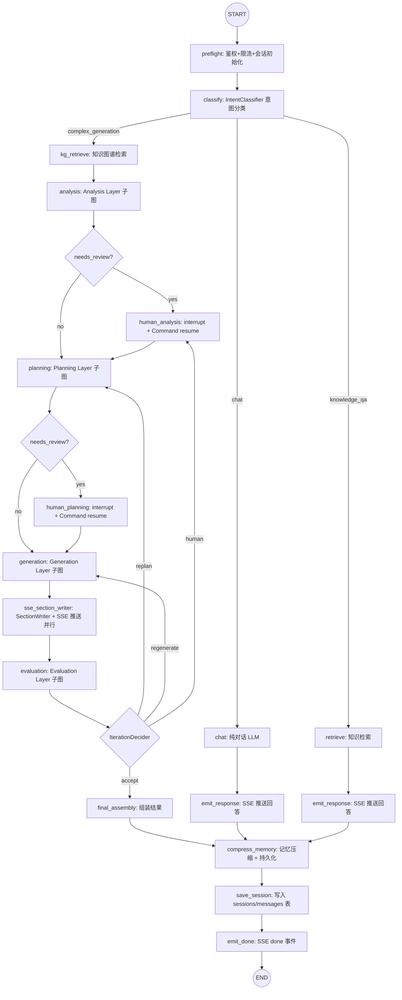

# 全链路深挖问题汇总 & 架构重构方案

> **产出日期**：2026-07-27
> **依据**：逐文件、逐节点、逐链路深挖报告（覆盖 4 层 LangGraph 共 43 个节点 + 18 个 API 路由模块 + 全部基础设施组件）
> **核心目标**：① LangGraph 全链路编排 ② 崩溃/中断可恢复 ③ 历史会话记忆完整

---

## 零、架构原则：已有组件逻辑不变，错误进入护栏体系

> **以下组件的现有实现逻辑不改变**，仅解决"接线"问题——将它们接入 LangGraph 图中作为节点调用。

### 0.1 保持不变的核心组件

| 组件 | 文件 | 当前状态 | 重构动作 |
|------|------|---------|---------|
| **LLM Gateway** | `app/llm_gateway/` | ✅ 完整（限流/缓存/路由/成本追踪/熔断/Failover） | **不改逻辑**，包装为 `GatewayChatModel(BaseChatModel)` 供 LangChain 调用 |
| **护栏系统 (Guardrails)** | `app/llm_gateway/guardrails/` | ✅ 完整（注入检测/PII/内容安全/输出校验，pre_llm + post_llm 两阶段） | **不改逻辑**，扩展新增错误类护栏，作为 LangGraph 节点调用 |
| **上下文压缩 (ContextCompressor)** | `app/session_history/compressor.py` | ✅ 完整（summarize/rolling/truncate 三策略） | **不改逻辑**，接入 `compress_memory` LangGraph 节点 |
| **记忆检索 (MemoryRetriever)** | `app/session_history/memory_retriever.py` | ✅ 完整（recency/relevance/importance/hybrid 四策略） | **不改逻辑**，接入 `retrieve_memory` LangGraph 节点 |
| **历史消息管理 (SessionHistoryService)** | `app/session_history/service.py` + `repository.py` | ✅ CRUD 完整 | **不改逻辑**，由 `save_session` LangGraph 节点调用 |
| **会话摘要 (SessionSummarizer)** | `app/session_history/summarizer.py` | ✅ 完整（LLM 驱动摘要） | **不改逻辑**，接入 LangGraph 节点 |
| **事件总线 (EventBus)** | `app/streaming/event_bus.py` | ✅ 完整（asyncio.Queue Pub/Sub） | **不改逻辑**，调用方从 `TaskManager` 改为 LangGraph 节点 |

### 0.2 错误处理：统一进入护栏体系

> **核心原则**：错误处理不是独立模块，而是护栏系统的一个维度。
> 护栏已有 `pre_llm` / `post_llm` 两阶段拦截管道，错误处理作为新的护栏插件加入此管道。

```
当前护栏体系（4 个插件）：
  pre_llm:  [PromptInjectionGuardrail] → [PIIDetectorGuardrail]
  post_llm: [ContentSafetyGuardrail] → [OutputValidatorGuardrail]

扩展后护栏体系（7 个插件）：
  pre_llm:  [PromptInjectionGuardrail] → [PIIDetectorGuardrail] → [TimeoutGuardrail] ← NEW
  post_llm: [ContentSafetyGuardrail] → [OutputValidatorGuardrail] → [EmptyResponseGuardrail] ← NEW
                                                                   → [RetryDecisionGuardrail] ← NEW
```

**新增 3 个错误类护栏：**

| 护栏 | 阶段 | 职责 |
|------|------|------|
| `TimeoutGuardrail` | pre_llm | 调用前检查 CircuitBreaker 状态，超时/熔断时触发降级路径 |
| `EmptyResponseGuardrail` | post_llm | LLM 返回空字符串时判定为失败，触发重试决策 |
| `RetryDecisionGuardrail` | post_llm | 根据失败原因（空响应/JSON 解析失败/超时）决定重试或降级，写入 `GuardrailResult.metadata` 供 LangGraph 条件边使用 |

**护栏结果 → LangGraph 条件路由：**

```python
# 护栏检查结果驱动 LangGraph 路由
class GuardrailResult:
    passed: bool
    blocked: bool
    reason: str
    severity: str  # info / warning / critical
    metadata: dict  # ← 扩展字段：{"retry": True, "fallback_model": "gpt-4o-mini", "max_retries": 3}

# LangGraph 图中：
def route_after_guardrail(state: OrchestratorState) -> str:
    """护栏结果决定路由。"""
    result = state.get("guardrail_result")
    if not result.passed and result.metadata.get("retry"):
        if state["retry_count"] < result.metadata.get("max_retries", 3):
            return "retry"       # 重新执行上一节点
    if result.blocked:
        return "blocked"         # 拒绝请求
    return "continue"            # 正常继续
```

### 0.3 删除的自定义错误处理代码

| 文件 | 删除内容 | 替代 |
|------|---------|------|
| `app/analysis_layer/tools.py:52-68` | `call_llm_async` 中 `except Exception: return ""` | `EmptyResponseGuardrail` + `RetryDecisionGuardrail` |
| `app/planning_layer/tools.py:42-55` | 同上 | 同上 |
| `app/evaluation/tools.py:22-36` | 同上 | 同上 |
| `app/task_manager.py:270-295` | `try/except Exception: _mark_failed()` | `RetryDecisionGuardrail` → LangGraph 条件边 → `retry` 或 `error_handler` 节点 |
| `app/task_manager.py:345-353` | `try/except Exception: _mark_failed()` (resume 路径) | 同上 |
| `app/api/routes/stream_qna.py:130-135` | `except Exception: yield SseEvent.error()` | LangGraph error 边 + EventBus 副作用 |

---

## 一、当前问题全量汇总

### 1.1 架构层面（3 个根因问题）

| # | 根因 | 表现 |
|---|------|------|
| **A1** | LangGraph 只编排核心 5 步管线，其余流程全部在 LangGraph 外部以硬编码方式运行 | SSE 推送逻辑写在 `TaskManager._execute_task()` 的 `astream` 循环里；会话管理通过独立 API 路由操作，从未接入图；批量任务/Web 索引/文档管理各自独立运行 |
| **A2** | 无任务级错误处理和状态持久化 | `_execute_task` / `_resume_task` 的 `try/except` 直接 `_mark_failed`，无重试/无检查点保存；`MemorySaver` 纯内存实现，重启全丢；`TaskQueue` + `TaskExecutor` 已实现但零接入 |
| **A3** | 历史记忆管理组件全部"已创建但零调用" | `ContextCompressor` 和 `MemoryRetriever` 在 `SessionHistoryService.__init__` 中实例化，但整个项目没有任何调用点；任务结果只存内存 dict，不写入 `sessions` 表 |

### 1.2 节点/数据流层面（15 个具体问题）

#### 🔴 严重（运行时影响）

| # | 位置 | 问题 |
|---|------|------|
| R1 | `stream_qna.py:58` | `get_retrieval_pipeline()` 函数不存在于 `knowledge_layer/pipeline.py`，`POST /qna/stream` 知识检索永远失败 |
| R2 | `task_executor.py:92` | `EvaluationOrchestrator` 类不存在，导入此文件即崩溃 |
| R3 | `main.py:78-86` | `ToolRegistry` 注册 8 个 Agent 工具但全项目零调用 |
| R4 | `plan_self_check.py:48` | `PlanSelfCheckNode` 写入 `self_check_passed` 但 LangGraph 图从未根据此结果做条件路由 |
| R5 | `batch/tasks.py:21-65` | 3 个 Celery 任务全是空壳（仅 `logger.info` + `return`） |

#### 🟡 数据流断裂 / Token 浪费

| # | 位置 | 问题 | 每次浪费 |
|---|------|------|---------|
| M1 | `stakeholder_analyzer.py:52` | LLM 产出 `stakeholders` 但 `AnalysisResultAssemblerNode` 不读取 | ~1,000 tokens |
| M2 | `clarity_checker.py:48` | LLM 产出 `clarity_issues` 但 `AnalysisResultAssemblerNode` 不读取 | ~500 tokens |
| M3 | Planning 7 节点 | Cost/Timeline/SkillGap/Risk/DataArch/API/Deploy 的 LLM 产出写入 `node_outputs` → `metadata`，最终方案文档不呈现 | ~4,200 tokens |
| M4 | `session_history/service.py:59-60` | `ContextCompressor` + `MemoryRetriever` 实例化后零调用 | — |
| M5 | `core/task_queue.py` + `core/task_executor.py` | 已实现但零接入 `TaskManager` | — |
| M6 | `main.py:105-110` | `CORS allow_origins=["*"]` + `allow_credentials=True` | — |
| M7 | `app/core/llm.py` | 全项目零调用方的死代码 | — |

---

## 二、当前未使用 LangGraph 的自定义流程编排（逐文件列举）

> 以下**每一个位置**都是用自定义 Python 代码（`asyncio.create_task` / `if/elif` 分支 / `async for` 循环 / `try/except` 手动降级）做流程编排，应当全部替换为 LangGraph 图节点。

### 2.1 主任务管线：`app/task_manager.py`

| 行号 | 自定义编排方式 | 具体代码 | 应改为 |
|------|--------------|---------|--------|
| 98 | `asyncio.create_task()` 触发异步执行 | `asyncio.create_task(self._execute_task(...))` | LangGraph 图的一个节点 `execute_pipeline`，由 `orchestrator.astream()` 统一驱动 |
| 173 | `asyncio.create_task()` 恢复执行 | `asyncio.create_task(self._resume_task(...))` | 外部直接调用 `orchestrator.astream(Command(resume=...), config)`，不需要 TaskManager 包装 |
| 245-270 | `async for` 循环手动消费 `astream`，内嵌 SSE 推送 | `async for step_state in orchestrator.astream(...): await self._emit(...)` | SSE 推送作为 LangGraph 节点的副作用，`astream` 循环由 API 路由层消费 |
| 321-340 | 同上（resume 路径） | 同上 | 同上 |
| 354-395 | 手动更新内存 dict `_tasks` | `record["status"] = status; record["result"] = ...` | `save_session` 节点写入 PostgreSQL，State 自动 checkpoint |
| 398-420 | 手动 `_mark_failed` 写内存 dict | `record["status"] = "failed"` | LangGraph 异常自动转为 State `status="failed"` + checkpoint 保存 |

**问题本质**：`TaskManager` 本身就是一个"土法 StateGraph"——它管理 `_tasks` dict 的状态机（running/paused/complete/failed）、协调 `asyncio.create_task` 的并发、在 `astream` 循环里做 SSE 推送。这些全部是 LangGraph 应该做的事。

### 2.2 意图路由：`app/api/routes/chat.py`

| 行号 | 自定义编排方式 | 具体代码 | 应改为 |
|------|--------------|---------|--------|
| 54-56 | `IntentClassifier` 调用在路由处理器中 | `classifier = IntentClassifier(llm_gateway=gateway)` → `intent_result = await classifier.classify(...)` | LangGraph 的 `classify` 节点 |
| 62-73 | `if/elif` 分支做路由决策 | `if intent == IntentType.CHAT: ... elif intent == IntentType.KNOWLEDGE_QA: ... elif intent == IntentType.COMPLEX_GENERATION:` | LangGraph `add_conditional_edges("classify", route_by_intent, {"chat": ..., "knowledge_qa": ..., ...})` |
| 65-69 | `CHAT` 分支手动调 LLM | `resp = await gateway.complete(prompt=req.message, ...)` | LangGraph 的 `chat_node` |
| 75-103 | `KNOWLEDGE_QA` 分支手动做检索→LLM，含 `try/except` 降级 | `pipeline = RetrievalPipeline()` → `ctx = await pipeline.retrieve(...)` → `resp = await gateway.complete(...)` | LangGraph 的 `retrieve_node` → `generate_answer_node` 链，降级用条件边 |
| 105-120 | `COMPLEX_GENERATION` 分支手动调 `task_manager.create_task()` | `await task_manager.create_task(prd_raw=req.message, ...)` | 统一走 LangGraph `complex_generation` 路径，从 graph 入口进入 |

### 2.3 流式 Q&A：`app/api/routes/stream_qna.py`

| 行号 | 自定义编排方式 | 具体代码 | 应改为 |
|------|--------------|---------|--------|
| 44-141 | 整个端点是一个手动 `async def event_generator()` 多阶段流程 | 阶段1→检索、阶段2→LLM流式、阶段3→done | 三个阶段各自作为 LangGraph 节点，SSE 推送作为节点副作用 |
| 56-87 | 手动 `try/except` 检索 | `pipeline = get_retrieval_pipeline()` → `retrieval_result = await pipeline.retrieve(...)` | LangGraph `retrieve` 节点 |
| 100-122 | 手动 `async for chunk in gateway.stream_complete()` | 内嵌 SSE 推送 | LangGraph `stream_generate` 节点 + EventBus 副作用 |
| 130-135 | 手动 `try/except Exception` 兜底 | `yield SseEvent.error(...)` | LangGraph 节点异常自动进入 error 边 |

### 2.4 流式任务事件订阅：`app/api/routes/stream_generate.py`

| 行号 | 自定义编排方式 | 具体代码 | 应改为 |
|------|--------------|---------|--------|
| 25-60 | 手动 `_subscribe_task_events()` async generator | `asyncio.wait_for(queue.get(), timeout=KEEPALIVE_INTERVAL)` → `TimeoutError` 心跳 | SSE 订阅作为 LangGraph 图的外部消费者，不改变图结构；但生成器逻辑应简化 |
| 64-78 | 手动 `_sse_response()` 包装 | `StreamingResponse(generator, media_type="text/event-stream", ...)` | 保留（这是 FastAPI 层面的 HTTP 协议适配，不算流程编排） |
| 130-165 | 手动 `create_streaming_generation()` 的多步骤 | `task_manager.create_task()` → `event_bus.subscribe()` → SSE 流 | 创建任务 → 进入 LangGraph 图 → 图节点推送事件 → SSE 路由消费 |

### 2.5 任务审核：`app/api/routes/review.py`

| 行号 | 自定义编排方式 | 具体代码 | 应改为 |
|------|--------------|---------|--------|
| 49-65 | 手动调用 `task_manager.resolve_review()` | `success = await task_manager.resolve_review(task_id, stage, decision, comment)` | 外部直接 `orchestrator.astream(Command(resume={"decision": decision}), {"configurable": {"thread_id": thread_id}})` |

### 2.6 独立评测：`app/api/routes/evaluate.py`

| 行号 | 自定义编排方式 | 具体代码 | 应改为 |
|------|--------------|---------|--------|
| 42-50 | 手动构造 `input_state` dict → 直接 `evaluation_graph.ainvoke()` | `input_state = {"analysis_result": ..., ...}` → `result = await evaluation_graph.ainvoke(input_state)` | 这是独立的 Evaluation 子图调用，可保留但应统一到主编排图中作为一个可复用子图 |

### 2.7 知识图谱构建：`app/api/routes/knowledge.py`

| 行号 | 自定义编排方式 | 具体代码 | 应改为 |
|------|--------------|---------|--------|
| 42-56 | 手动文件保存 → 构建 → 清理 | `tmp_path.write_bytes(content)` → `builder.build_from_document(...)` → `tmp_path.unlink()` | LangGraph 知识摄入子图：`receive_file` → `parse` → `build_kg` → `cleanup` |

### 2.8 Web 索引：`app/api/routes/web_indexing.py`

| 行号 | 自定义编排方式 | 具体代码 | 应改为 |
|------|--------------|---------|--------|
| 54-80 | 手动顺序执行：抓取 → 写 KG | `loader.fetch(url)` → `builder.build_from_text(text, ...)` | LangGraph `web_fetch` → `kg_index` 链 |
| 82-90 | 手动 `try/except` 降级 | `try: ... except Exception: logger.warning(...)` | LangGraph 条件边（成功→下一步 / 失败→降级节点） |

### 2.9 批量任务：`app/batch/tasks.py` + `app/batch/scheduler.py`

| 行号 | 自定义编排方式 | 具体代码 | 应改为 |
|------|--------------|---------|--------|
| 21-32 | Celery 任务内手动 `try/except` + `self.retry()` | `try: ... except Exception: raise self.retry(exc=exc)` | 每个 Celery 任务内部启动一个 LangGraph 子图执行，异常走图内 error 边 |
| 33-42 | 同上 | 同上 | 同上 |
| 43-52 | 同上 | 同上 | 同上 |
| `scheduler.py:55-63` | 手动 `trigger_now()` 方法 | `return {"success": True, ...}` | 应触发 LangGraph 图执行 |

### 2.10 任务执行器：`app/core/task_executor.py`

| 行号 | 自定义编排方式 | 具体代码 | 应改为 |
|------|--------------|---------|--------|
| 39-45 | 手动 `build_orchestrator_graph()` + `ainvoke()` | `orchestrator = build_orchestrator_graph()` → `await orchestrator.ainvoke(state)` | 此文件整个应删除，统一走主编排图 |
| 53-62 | 手动循环 `for doc_id in ...: await builder.build_from_document()` | 同上 | LangGraph 子图内 Send() 并行 |
| 73-78 | 手动调 `EvaluationOrchestrator`（不存在） | `evaluator = EvaluationOrchestrator()` → `result = await evaluator.evaluate(...)` | 删除（类不存在，会崩溃） |
| 88-94 | 手动调 `WebIndexer` | `indexer = WebIndexer()` → `await indexer.sync(...)` | LangGraph `web_sync` 子图 |

### 2.11 Agent 工具注册：`app/main.py`（lifespan）

| 行号 | 自定义编排方式 | 具体代码 | 应改为 |
|------|--------------|---------|--------|
| 78-86 | 手动 `for tool_cls in [...]: ToolRegistry.register(tool_cls())` | 注册了 8 个工具但全项目零调用 | 工具应在 LangGraph 节点的 ToolNode 中按需调用，不应在 lifespan 中全局注册 |

### 2.12 事件总线：`app/streaming/event_bus.py`

| 行号 | 自定义编排方式 | 具体代码 | 应改为 |
|------|--------------|---------|--------|
| 全文件 | 手动 `asyncio.Queue` Pub/Sub 实现 | `self._channels: dict[str, set[asyncio.Queue]]` | 保留（这是 SSE 传输层基础设施，不是流程编排），但应由 LangGraph 节点调用而非 TaskManager |

---

### 2.13 汇总：自定义编排 vs 应使用的 LangGraph 能力

| 当前自定义方式 | 出现位置（文件数） | 应使用的 LangGraph 能力 |
|---------------|------------------|----------------------|
| `asyncio.create_task()` 触发执行 | `task_manager.py` (2处) | `orchestrator.astream()` 统一入口 |
| `if/elif/else` 分支路由 | `chat.py` (4分支) | `add_conditional_edges()` |
| `async for` 循环消费 `astream` + 内嵌副作用 | `task_manager.py` (2处) | 副作用放入图节点的 `run()` 内部 |
| `try/except` 手动降级 | `chat.py`, `stream_qna.py`, `web_indexing.py`, `knowledge.py` | LangGraph 条件边（成功/失败分支） |
| 手动构造 `input_state` dict → `.ainvoke()` | `evaluate.py`, `task_executor.py` | 统一主编排图，用于子图复用 |
| 手动顺序执行多步骤 | `knowledge.py`, `web_indexing.py` | LangGraph 图节点链 |
| 手动 `_tasks` 内存 dict 状态管理 | `task_manager.py` | PostgreSQL Checkpointer 自动管理 |
| `asyncio.Queue` Pub/Sub | `event_bus.py` | 保留（传输层），由 LangGraph 节点调用 |

---

## 三、LangChain + LangGraph 节点内部重构方案

> ⚠️ **策略变更**：`VIBE_CODING_RULES.md` 原"禁用 LangChain 全家桶"规则**对 Agent 节点内部逻辑放行**。LangChain 负责节点内部的 LLM 调用/Prompt 管理/输出解析/工具调用，LangGraph 负责节点之间的编排路由。两者职责明确，互不越界。

### 3.1 职责边界

```
┌─ LangGraph（编排层）─────────────────────────────────────┐
│                                                          │
│  负责：                                                  │
│  - StateGraph 构建（节点注册 + 连线 + 条件边）            │
│  - State 管理（TypedDict + reducer + checkpoint）        │
│  - 路由决策（conditional_edges）                         │
│  - 并行扇出（Send）                                      │
│  - 人机交互（interrupt + Command resume）                │
│  - 子图嵌套（add_node 传入编译后的子 StateGraph）         │
│                                                          │
│  ❌ 不负责：LLM 调用、Prompt 拼接、JSON 解析、工具调用    │
└──────────────────────────────────────────────────────────┘
                          │
                          │ 每个节点内部 ↓
                          │
┌─ LangChain（节点内部）───────────────────────────────────┐
│                                                          │
│  负责：                                                  │
│  - Prompt 模板（ChatPromptTemplate / MessagesPlaceholder）│
│  - LLM 调用（ChatOpenAI / 包装 Gateway 的自定义 ChatModel）│
│  - 结构化输出（with_structured_output / PydanticOutputParser）│
│  - LCEL 链式组合（prompt | llm | parser）                │
│  - 工具调用（bind_tools + ToolNode）                      │
│  - 自动重试（with_retry / with_fallbacks）                │
│                                                          │
│  ❌ 不负责：节点间路由、State 定义、checkpoint            │
└──────────────────────────────────────────────────────────┘
```

### 3.2 当前 43 个节点中的 6 种自定义代码模式 → LangChain 替换

#### 模式 1：手动 Prompt 字符串拼接

**当前（自定义代码）** — 出现在全部 43 个节点中：

```python
# app/analysis_layer/nodes/requirement_node.py (当前)
REQUIREMENT_PROMPT = """你是一个需求分析师。从以下 PRD 内容中提取功能需求和非功能需求。
...
PRD 内容：
{text}
"""

class RequirementExtractorNode:
    async def run(self, state: AnalysisState) -> AnalysisState:
        prompt = REQUIREMENT_PROMPT.format(text=state["prd_raw"][:8000])
        response = await call_llm_async(prompt, model="deepseek-v3")
```

**替换（LangChain）**：

```python
# 重构后
from langchain_core.prompts import ChatPromptTemplate

REQUIREMENT_PROMPT = ChatPromptTemplate.from_messages([
    ("system", "你是一个需求分析师。从以下 PRD 内容中提取功能需求和非功能需求。"),
    ("system", "每个需求必须包含: id (FR-001格式), type, category, priority, description, actor, acceptance_criteria, source_section"),
    ("human", "{prd_text}"),
])

class RequirementExtractorNode:
    def __init__(self, llm: BaseChatModel):
        self.chain = REQUIREMENT_PROMPT | llm

    async def run(self, state: AnalysisState, runtime: OrchestratorRuntime) -> AnalysisState:
        response = await self.chain.ainvoke({"prd_text": state["prd_raw"][:8000]})
```

#### 模式 2：手动 JSON 解析 + Pydantic 实例化

**当前（自定义代码）** — 出现在 28 个 LLM 调用节点中：

```python
# app/analysis_layer/nodes/requirement_node.py (当前)
try:
    raw = extract_json_from_llm(response)    # 正则扒 JSON
    data = json.loads(raw)                   # 手动 json.loads
    if isinstance(data, list):
        requirements = [RequirementDetail(**item) for item in data]  # 手动 Pydantic
    else:
        requirements = [RequirementDetail(**data)]
except (json.JSONDecodeError, Exception):
    requirements = []                        # 静默丢弃
```

**替换（LangChain `with_structured_output`）**：

```python
# 重构后 — 一条链完成 Prompt → LLM → Pydantic 输出
from langchain_core.pydantic_v1 import BaseModel as LangChainBaseModel

class RequirementList(LangChainBaseModel):
    """需求列表 — LLM 结构化输出。"""
    requirements: list[RequirementDetail]

class RequirementExtractorNode:
    def __init__(self, llm: BaseChatModel):
        self.chain = REQUIREMENT_PROMPT | llm.with_structured_output(RequirementList)

    async def run(self, state: AnalysisState, runtime: OrchestratorRuntime) -> AnalysisState:
        try:
            result = await self.chain.ainvoke({"prd_text": state["prd_raw"][:8000]})
            return {**state, "extracted_requirements": result.requirements}
        except Exception:
            return {**state, "extracted_requirements": []}
```

**优势**：
- 不再需要 `extract_json_from_llm()` 正则函数
- 不再需要手动 `json.loads()` + `try/except`
- `with_structured_output()` 使用 LLM 的 JSON mode / function calling 原生约束
- Pydantic 自动校验，不合规的字段直接报错而非静默丢弃

#### 模式 3：手动 `call_llm_async()` 包装函数

**当前（自定义代码）** — 3 个 tools.py 各有自己的包装：

```python
# app/analysis_layer/tools.py (当前)
async def call_llm_async(prompt: str, model: str | None = None, **kwargs: Any) -> str:
    try:
        resp = await gateway.complete(prompt=prompt, task_type="...", model=model)
        return resp.content
    except Exception as exc:
        logger.warning("LLM 调用失败: %s", exc)
        return ""  # ⚠️ 静默返回空字符串，下游当作有效输入
```

```python
# app/evaluation/tools.py (当前)
async def call_llm(prompt: str, model: str | None = None, **kwargs: Any) -> str:
    # ... 几乎相同的代码 ...
```

```python
# app/planning_layer/tools.py (当前)
async def call_llm_async(prompt: str, model: str | None = None, **kwargs: Any) -> str:
    # ... 又一份几乎相同的代码 ...
```

**替换（LangChain 自定义 ChatModel 包装 Gateway）**：

```python
# app/llm_gateway/langchain_adapter.py (新文件)
from langchain_core.language_models.chat_models import BaseChatModel
from langchain_core.messages import BaseMessage, AIMessage
from langchain_core.outputs import ChatResult, ChatGeneration

class GatewayChatModel(BaseChatModel):
    """将 LLM Gateway 包装为 LangChain BaseChatModel。
    
    保留 Gateway 的成本追踪、速率限制、熔断、护栏等功能，
    同时提供 LangChain 的标准接口（ainvoke/astream/bind_tools 等）。
    """
    
    gateway: LLMGateway
    default_model: str = "deepseek-chat"
    task_type: str = "default"
    layer: str = ""
    node: str = ""

    def _generate(self, messages, stop=None, run_manager=None, **kwargs):
        raise NotImplementedError("使用异步接口 ainvoke")
    
    async def _agenerate(self, messages, stop=None, run_manager=None, **kwargs):
        """将 LangChain messages 转为 Gateway prompt 调用。"""
        prompt = self._messages_to_prompt(messages)
        resp = await self.gateway.complete(
            prompt=prompt,
            task_type=self.task_type,
            layer=self.layer,
            node=self.node,
            model=kwargs.get("model", self.default_model),
        )
        return ChatResult(generations=[ChatGeneration(message=AIMessage(content=resp.content))])

    async def _astream(self, messages, stop=None, run_manager=None, **kwargs):
        """流式接口 — Gateway.stream_complete()。"""
        prompt = self._messages_to_prompt(messages)
        async for token in self.gateway.stream_complete(prompt=prompt, ...):
            yield ChatGenerationChunk(message=AIMessageChunk(content=token))

    @staticmethod
    def _messages_to_prompt(messages: list[BaseMessage]) -> str:
        return "\n".join(
            f"{'System' if m.type == 'system' else 'User' if m.type == 'human' else 'Assistant'}: {m.content}"
            for m in messages
        )
```

**使用方式**：

```python
# 节点中直接使用 LangChain 标准接口
from app.llm_gateway.langchain_adapter import GatewayChatModel

# Analysis 层 LLM
analysis_llm = GatewayChatModel(
    gateway=gateway,
    task_type="analysis_requirement",
    layer="analysis",
    node="requirement_extractor",
)

# 一行代码创建节点
node = RequirementExtractorNode(llm=analysis_llm)
```

**优势**：
- 消除 3 个 tools.py 中的重复 `call_llm_async` 函数
- Gateway 的成本追踪/限流/熔断 全部保留
- 所有 LangChain `with_retry()` / `with_fallbacks()` 自动可用
- 支持 `bind_tools()` 做 Function Calling

#### 模式 4：手动评分解析函数

**当前（自定义代码）** — `app/evaluation/tools.py`：

```python
def parse_score(response: str, field: str = "score") -> float:
    if not response:
        return 5.0
    try:
        json_match = re.search(r"\{.*\}", response, re.DOTALL)  # 正则扒 JSON
        if json_match:
            data = json.loads(json_match.group())
            return float(data.get(field, 5.0))
    except:
        pass
    return 5.0  # ⚠️ 默认 5.0 分，掩盖真实问题
```

**替换（LangChain PydanticOutputParser）**：

```python
from langchain_core.output_parsers import PydanticOutputParser
from langchain_core.pydantic_v1 import BaseModel, Field

class ScoreResult(BaseModel):
    score: float = Field(description="评分 (0-10)")
    issues: list[str] = Field(default_factory=list, description="发现的问题")
    verdict: str = Field(default="可行", description="结论")

class PRDCoverageCheckNode:
    def __init__(self, llm: BaseChatModel):
        parser = PydanticOutputParser(pydantic_object=ScoreResult)
        self.chain = COVERAGE_PROMPT | llm | parser

    async def run(self, state: EvaluationState) -> EvaluationState:
        try:
            result: ScoreResult = await self.chain.ainvoke({...})
            return {"dimension_scores": {"prd_coverage": result.score}}
        except Exception:
            return {"dimension_scores": {"prd_coverage": 5.0}}
```

#### 模式 5：手动流式处理

**当前（自定义代码）** — `app/generation_layer/nodes/section_writer.py`：

```python
async for token in gateway.stream_complete(prompt=prompt, ...):
    full_content_parts.append(token)
    chunk_buffer += token
    if len(chunk_buffer) >= chunk_threshold:         # 手动 200 字符分块
        await _emit_generation_event(task_id, "generation.chunk", ...)
        chunk_buffer = ""
```

**替换（LangChain `.astream_events()`）**：

```python
class SectionWriterNode:
    def __init__(self, llm: BaseChatModel):
        self.chain = SECTION_PROMPT | llm

    async def run(self, state: GenerationState, runtime: OrchestratorRuntime) -> GenerationState:
        event_bus = runtime.event_bus
        full_content = []

        # LangChain 原生流式事件 — 自动分 token/chunk
        async for event in self.chain.astream_events(input_dict, version="v2"):
            if event["event"] == "on_chat_model_stream":
                token = event["data"]["chunk"].content
                full_content.append(token)
                
                # SSE 推送作为副作用
                await event_bus.publish(f"task:{state['task_id']}", SseEvent(
                    type="generation.chunk",
                    payload={"content": token},
                ))

        return {"section_contents": {section.section_id: "".join(full_content)}}
```

#### 模式 6：手动工具注册 + 零使用

**当前（自定义代码）** — `app/main.py`：

```python
for tool_cls in [
    SearchKnowledgeTool, GetEntityTool, ReadFileTool, SearchDocTool,
    CallLLMTool, GenerateCodeTool, ReadCodeTool, ReadTimeTool, ListFilesTool,
]:
    ToolRegistry.register(tool_cls())
```

**替换（LangChain `bind_tools` + LangGraph `ToolNode`）**：

```python
# 节点中绑定工具
from langgraph.prebuilt import ToolNode

# 定义工具（用 @tool 装饰器）
from langchain_core.tools import tool

@tool
def search_knowledge(query: str, top_k: int = 5) -> list[dict]:
    """搜索知识图谱。"""
    pipeline = RetrievalPipeline()
    ctx = await pipeline.retrieve(query, top_k=top_k)
    return [{"id": r.id, "text": r.text} for r in ctx.results]

# LangGraph 图中注册 ToolNode
tools = [search_knowledge, get_entity, read_file, ...]
tool_node = ToolNode(tools)

graph.add_node("tools", tool_node)
graph.add_conditional_edges("agent", should_use_tools, {"tools": "tools", "end": END})
```

### 3.3 删除清单：重构后可删除的自定义代码

| 文件 | 删除内容 | 原因 |
|------|---------|------|
| `app/analysis_layer/tools.py` | `call_llm_async()` | 由 `GatewayChatModel` 替代 |
| `app/analysis_layer/tools.py` | `extract_json_from_llm()` | 由 `PydanticOutputParser` / `with_structured_output()` 替代 |
| `app/planning_layer/tools.py` | `call_llm_async()` | 同上 |
| `app/evaluation/tools.py` | `call_llm()` | 同上 |
| `app/evaluation/tools.py` | `parse_score()` | 由 `PydanticOutputParser` 替代 |
| `app/core/llm.py` | 全文件 | 已是死代码 |
| `app/agents/registry.py` | `ToolRegistry` 类 | 由 `ToolNode` 替代 |
| `app/main.py:78-86` | 手动工具注册代码 | 由 `ToolNode(tools)` 替代 |

### 3.4 新增清单：需要新建的文件

| 文件 | 内容 |
|------|------|
| `app/llm_gateway/langchain_adapter.py` | `GatewayChatModel` — 将 Gateway 包装为 LangChain `BaseChatModel` |
| `app/agents/tools/langchain_tools.py` | 用 `@tool` 装饰器重写 8 个工具 |
| `tests/unit/test_langchain_adapter.py` | `GatewayChatModel` 的单元测试 |

### 3.5 依赖变更

```diff
# pyproject.toml / requirements.txt
+ langchain-core>=0.3.0          # Prompt / OutputParser / BaseChatModel / tools
+ langchain-openai>=0.2.0        # ChatOpenAI（可选，用于直接调 OpenAI）
- (无需 langchain 全家桶，只引入 core + 必要 provider)
```

> ⚠️ `VIBE_CODING_RULES.md` 的"禁用 LangChain"规则仅禁用 `langchain` 全家桶（含 langchain-community 等重依赖）。`langchain-core` 是轻量基础库，`langgraph` 本身就依赖它。

---

## 四、LangGraph 全链路编排设计

### 4.1 设计原则

```
原则 1：所有流程（生成 / SSE 推送 / 会话管理 / 记忆压缩 / 文档索引 / 错误恢复）
        必须作为 LangGraph 图中的一个节点或子图运行，不得在图外部硬编码。

原则 2：人机交互点统一使用 LangGraph `interrupt()` + `Command(resume=...)` 模式，
        不得用自定义的 `status="paused"` + 轮询方式。

原则 3：多条件并行分支使用 `Send()` 扇出 + reducer 自动合并，
        不得在 Node 内部手动管理并发。

原则 4：配置（静态）/ State（动态快照）/ Runtime（环境变量、连接串）
        三者严格分离，运行时信息从 Runtime 层读取，不写入 State。
```

### 4.2 三层数据模型

```python
# ── 层一：配置（Config）── 启动时加载，只读 ──
class OrchestratorConfig(BaseModel):
    """主编排器静态配置 — 从 pyproject.toml / env 加载后不变。"""
    max_iterations: int = 3
    evaluation_pass_threshold: float = 85.0
    evaluation_replan_threshold: float = 70.0
    max_llm_retries: int = 3
    keepalive_interval: int = 30
    session_ttl_days: dict[str, int] = {"free": 30, "pro": 180}

# ── 层二：运行时（Runtime）── 每次请求从 Context 注入，不在 State 中持久化 ──
class OrchestratorRuntime:
    """运行时上下文 — 每次调用从外部注入，不参与 checkpoint 序列化。"""
    db_session: AsyncSession          # 数据库会话
    event_bus: EventBus               # SSE 事件总线
    llm_gateway: LLMGateway           # LLM Gateway
    current_user_id: str              # 当前用户 ID
    current_workspace_id: str         # 当前工作空间 ID
    started_at: datetime              # 请求开始时间

# ── 层三：State（Checkpoint）── LangGraph 自动持久化，断点恢复依据 ──
class OrchestratorState(TypedDict):
    """主编排器状态 — 全部进入 LangGraph checkpoint。"""
    # ... 所有业务数据字段 ...
    # 注意：不再包含 runtime 信息（db_session / event_bus 等）
```

### 4.3 全链路 LangGraph 图设计

当前问题：只有 5 步管线在 LangGraph 内，SSE/会话/记忆/批量 全部在图外。

重构后：**一棵统一的 StateGraph**，覆盖从 API 入口到 SSE 完成的全部流程。



### 4.4 关键节点实现规范

#### 4.4.1 Human-in-the-Loop → `Command(resume=...)`

```python
# ✅ 正确：LangGraph 原生 interrupt/resume
class HumanReviewNode:
    def run(self, state: OrchestratorState, runtime: OrchestratorRuntime) -> OrchestratorState:
        review_context = {
            "stage": self.stage,
            "task_id": state["task_id"],
            "data": self._extract_review_data(state),
        }
        # ⬇ LangGraph 原生 interrupt — checkpoint 自动保存
        feedback = interrupt(review_context)
        
        # ⬆ 外部通过 POST /review/{task_id}/{stage} 调用
        #   orchestrator.astream(Command(resume={"decision": "approved"}), config)
        #   LangGraph 从此处继续执行
        
        if feedback.get("decision") == "needs_changes":
            state["status"] = "paused"  # 注意：这里实际会被 resume 覆盖
        return state

# ❌ 错误：当前实现 — 手动管理 status + 轮询
# state["status"] = "paused"  # 在 LangGraph 外部通过 TaskManager 轮询
```

#### 4.4.2 并行扇出 → `Send()`

```python
# ✅ 正确：LangGraph Send() 并行 + reducer 自动合并
def fan_out_sections(state: OrchestratorState) -> list[Send]:
    """为每个未写章节创建并行 Send。"""
    outline = state.get("outline", [])
    existing = state.get("section_contents", {})
    sends = []
    for section in outline:
        if section.section_id not in existing:
            sends.append(Send("section_writer", {
                **state,
                "_section_target": section,
            }))
    if not sends:
        sends.append(Send("sse_section_aggregator", state))
    return sends

# ❌ 错误：在 Node 内部手动 asyncio.gather() 并行
# 这会绕过 LangGraph 的 checkpoint 和 reducer 机制
```

#### 4.4.3 SSE 推送 → LangGraph 节点内副作用

```python
# ✅ 正确：SSE 作为 LangGraph 节点的副作用执行
class SSESectionWriterNode:
    """SSE 章节写入节点 — 既调用 LLM 又推送 SSE。"""
    
    async def run(self, state: OrchestratorState, runtime: OrchestratorRuntime) -> OrchestratorState:
        section = state["_section_target"]
        event_bus = runtime.event_bus
        task_id = state["task_id"]
        
        # 推送开始事件（副作用 — 不写入 State）
        await event_bus.publish(f"task:{task_id}", SseEvent(
            type="generation.section",
            payload={"section_id": section.section_id, "status": "generating"},
        ))
        
        # LLM 调用（核心逻辑 — 写入 State）
        content = ""
        async for token in runtime.llm_gateway.stream_complete(prompt=...):
            content += token
            # 推送 chunk（副作用）
            if len(content) % 200 == 0:
                await event_bus.publish(f"task:{task_id}", SseEvent(
                    type="generation.chunk",
                    payload={"section_id": section.section_id, "content": content[-200:]},
                ))
        
        # 推送完成 + 写入 State
        await event_bus.publish(...)
        return {"section_contents": {section.section_id: content}}

# ❌ 错误：当前 — SSE 逻辑写在 TaskManager._execute_task 的 astream 循环里
# 不在图中，不受 checkpoint 保护
```

---

## 五、断点恢复机制设计

### 5.1 目标

> 用户中断任务或系统崩溃后，用户继续任务时可以直接恢复到中断/崩溃前的状态，从中断的节点精确继续执行。

### 5.2 核心方案：PostgreSQL Checkpointer 替换 MemorySaver

```python
# 当前（不可恢复）
from langgraph.checkpoint.memory import MemorySaver
graph.compile(checkpointer=MemorySaver())  # 重启全丢

# 目标（可恢复）
from langgraph.checkpoint.postgres import PostgresSaver
checkpointer = PostgresSaver(conn_string=settings.DATABASE_URL)
await checkpointer.setup()  # 自动建表 langgraph_checkpoints
graph.compile(checkpointer=checkpointer)
```

LangGraph 的 PostgreSQL checkpointer 自动管理：
- `thread_id` 维度的 checkpoint 快照
- 每个节点执行前后的 State 序列化
- `interrupt()` 挂起时的状态保存

### 5.3 恢复流程

```
用户继续任务：
  GET /api/v1/sessions/{session_id}  → 查看任务状态 + thread_id
  POST /api/v1/tasks/{task_id}/resume → 从 checkpoint 恢复

恢复流程：
  1. 查询 sessions 表获取 thread_id 和当前 status
  2. 如果 status == "interrupted" → 在 human_review 节点等待
     → 用户通过 POST /review/{task_id}/analysis 提交审核
     → orchestrator.astream(Command(resume=...), {"configurable": {"thread_id": thread_id}})
     → LangGraph 从 interrupt() 的下一行继续
  
  3. 如果 status == "failed" → 在某个节点崩溃
     → orchestrator.astream(None, {"configurable": {"thread_id": thread_id}})
     → LangGraph 从最后成功的 checkpoint 重放
     → 崩溃节点重新执行（如 LLM 调用重试）
  
  4. 如果系统崩溃 → 进程重启
     → PostgreSQL checkpointer 中 checkpoint 完好
     → 与情况 3 相同流程恢复
```

### 5.4 Runtime 注入（不参与 Checkpoint）

`Runtime` 对象（含 DB 会话、EventBus、LLM Gateway）**不写入 checkpoint**，每次恢复时重新注入：

```python
class RuntimeInjectorNode:
    """每个节点执行前自动注入 Runtime。
    
    使用 LangGraph 的 per-node 中间件机制。
    """
    
    def __init__(self, runtime_factory: Callable[[], OrchestratorRuntime]):
        self._runtime_factory = runtime_factory
    
    async def __call__(self, state: OrchestratorState, *, config: RunnableConfig) -> OrchestratorState:
        # 从 config 中提取 thread_id / user_id
        thread_id = config["configurable"]["thread_id"]
        # 重建 Runtime（新 DB 会话、新 EventBus 引用）
        runtime = await self._runtime_factory(thread_id, state.get("user_id", ""))
        # 注入到 state（不持久化 — 仅当前节点可见）
        state["_runtime"] = runtime
        return state
```

### 5.5 崩溃场景涵盖表

| 崩溃点 | 最后一次成功的 checkpoint | 恢复后行为 |
|--------|--------------------------|-----------|
| `knowledge_retrieval` 执行中 | 入口 `preflight` | 重新执行 knowledge_retrieval |
| `analysis` 子图第 7 个节点 | `analysis` 第 6 个节点 | 从第 7 个节点继续 |
| `SectionWriter` LLM 流式中 | `outline` 节点 | 重新执行该 SectionWriter |
| `evaluation` 并行中 1 个崩溃 | `generation` 节点 | 重新执行全部 evaluation |
| `final_assembly` 执行中 | `evaluation` 完成 | 重新执行 final_assembly |
| `human_review` 等待中 | `interrupt()` 调用点 | 等待 Command(resume=...) |

---

## 六、历史会话记忆管理设计

### 6.1 目标

> 用户在一个历史会话中继续提问时，系统能加载之前的完整上下文（包括 LangGraph 状态），正确回答。如果该历史会话有一个中断的断点（如等待人工审核），继续任务时能接上这个断点。

### 6.2 核心方案：LangGraph State ↔ SessionHistory 双向绑定

```python
# sessions 表扩展字段
class Session(Base):
    # ... 现有字段 ...
    thread_id: str          # LangGraph thread_id（关键绑定字段）
    graph_state_snapshot: JSON  # 最后一次 checkpoint 的可读摘要
    current_node: str       # 当前所在节点名
    interrupt_stage: str    # 如果在 interrupt，记录阶段
    checkpoint_ts: datetime # 最后一次 checkpoint 时间
```

### 6.3 记忆生命周期

```
┌─ 会话创建 ────────────────────────────────────────────────────┐
│ POST /api/v1/sessions                                           │
│   → SessionHistoryService.create_session()                      │
│   → 生成 thread_id = str(uuid.uuid4())                          │
│   → 写入 sessions 表 (thread_id = xxx)                         │
│   → 返回 session_id + thread_id                                 │
└────────────────────────────────────────────────────────────────┘
                              │
                              ▼
┌─ 用户提问（在会话中）──────────────────────────────────────────┐
│ POST /api/v1/chat  { session_id: "xxx", message: "..." }       │
│   → 查询 sessions 表获取 thread_id                              │
│   → orchestrator.astream(                                      │
│       message,                                                  │
│       {"configurable": {"thread_id": thread_id}}                │
│     )                                                           │
│   → LangGraph 自动加载该 thread 的最新 checkpoint               │
│   → 从上次中断/结束位置继续执行                                  │
│   → 完成后自动调用 save_session_state() 保存结果                │
└────────────────────────────────────────────────────────────────┘
                              │
                              ▼
┌─ 消息持久化（每个 turn 自动触发）──────────────────────────────┐
│ 在 LangGraph 图的 save_session 节点中：                         │
│   1. 从 State 提取本轮 user_message + assistant_response        │
│   2. session_service.add_message(session_id, role="user", ...)  │
│   3. session_service.add_message(session_id, role="assistant", .)│
│   4. 如果消息总数超过阈值 → 触发 compress_memory 节点           │
│   5. 更新 sessions 表的 message_count / token_count / summary   │
└────────────────────────────────────────────────────────────────┘
                              │
                              ▼
┌─ 记忆压缩（token 超限时自动触发）──────────────────────────────┐
│ compress_memory 节点（LangGraph 图中）：                         │
│   1. 调用 ContextCompressor.compress()                          │
│   2. 将旧消息压缩为 system prompt 摘要                          │
│   3. 将摘要注入到 State 的 compressed_context 字段               │
│   4. 后续 LLM 调用自动携带 compressed_context                   │
└────────────────────────────────────────────────────────────────┘
                              │
                              ▼
┌─ 记忆检索（新提问时加载相关历史）──────────────────────────────┐
│ retrieve_memory 节点（LangGraph 图中）：                         │
│   1. 调用 MemoryRetriever.retrieve(query, messages, strategy)   │
│   2. 返回 top_k 最相关的历史记忆                                │
│   3. 注入到 State 的 retrieved_memories 字段                    │
│   4. 后续 LLM 调用自动携带 retrieved_memories                   │
└────────────────────────────────────────────────────────────────┘
```

### 6.4 中断会话恢复（接上断点）

```
场景：用户在历史会话中有一个中断的任务（等待人工审核 analysis 结果）

用户操作：
  GET /api/v1/sessions/{session_id}
  → 返回 session 信息，包含：
    {
      "status": "interrupted",
      "current_node": "human_analysis",
      "interrupt_stage": "analysis",
      "thread_id": "abc-123"
    }

  POST /api/v1/review/{task_id}/analysis  { decision: "approved" }
  → TaskManager.resolve_review(task_id, stage, decision)
  → orchestrator.astream(
      Command(resume={"decision": "approved"}),
      {"configurable": {"thread_id": "abc-123"}}
    )
  → LangGraph 从 human_analysis 节点的 interrupt() 后继续
  → 执行 planning → generation → evaluation → final → save_session
  → 完成后 sessions 表 status = "complete"
```

---

## 七、修复实施计划

### Phase 1：Checkpoint 持久化（P0，1-2 天）

| 步骤 | 内容 | 涉及文件 |
|------|------|---------|
| 1.1 | 安装 `langgraph-checkpoint-postgres` | `pyproject.toml` |
| 1.2 | `MemorySaver` → `PostgresSaver` | `orchestrator/main_graph.py:263` |
| 1.3 | 分离 Config / State / Runtime 三层 | `orchestrator/state.py` 新增 `OrchestratorRuntime` |
| 1.4 | 验证：启动 → 中断 → 重启 → 恢复 | `tests/e2e/test_checkpoint_recovery.py` |

### Phase 2：LangGraph 全链路（P0，3-5 天）

| 步骤 | 内容 | 涉及文件 |
|------|------|---------|
| 2.1 | SSE 推送移入 LangGraph 节点（`sse_section_writer` / `emit_done`） | `generation_layer/nodes/sse_section_writer.py` (新) |
| 2.2 | 会话保存移入 `save_session` 节点 | `orchestrator/nodes/save_session.py` (新) |
| 2.3 | 意图分类移入 `classify` 节点 | `orchestrator/nodes/intent_classify.py` (新) |
| 2.4 | `chat` / `knowledge_qa` 路径加入图 | `orchestrator/main_graph.py` |
| 2.5 | Runtime 注入中间件 | `orchestrator/runtime.py` (新) |
| 2.6 | `POST /qna/stream` 修复 `get_retrieval_pipeline` | `api/routes/stream_qna.py` |
| 2.7 | `PlanSelfCheckNode` 接入条件路由 | `planning_layer/agent_graph.py` |
| 2.8 | 移除 `TaskManager._execute_task` 中的硬编码 SSE | `task_manager.py` |

### Phase 3：记忆增强接入（P1，2-3 天）

| 步骤 | 内容 | 涉及文件 |
|------|------|---------|
| 3.1 | `ContextCompressor` 接入 `compress_memory` 节点 | `orchestrator/nodes/compress_memory.py` (新) |
| 3.2 | `MemoryRetriever` 接入 `retrieve_memory` 节点 | `orchestrator/nodes/retrieve_memory.py` (新) |
| 3.3 | Session ↔ Thread 双向绑定 | `session_history/models.py` / `service.py` |
| 3.4 | 每个 turn 自动 `save_session` | `orchestrator/nodes/save_session.py` |
| 3.5 | `POST /chat` 支持 `session_id` 参数 | `api/routes/chat.py` |

### Phase 4：数据流修复 + Token 优化（P1，1-2 天）

| 步骤 | 内容 | 涉及文件 |
|------|------|---------|
| 4.1 | `AnalysisResultAssemblerNode` 消费 `stakeholders` + `clarity_issues` | `analysis_layer/nodes/result_assembler.py` |
| 4.2 | `PlanAssemblerNode` 结构化呈现全部 `node_outputs` 字段 | `planning_layer/nodes/plan_assembler.py` |
| 4.3 | `GenerationAdapter` 传递 `export_formats` | `orchestrator/adapters/generation_adapter.py` |
| 4.4 | Celery 任务填空实现 | `batch/tasks.py` |

### Phase 5：死代码清理 + 安全检查（P2，0.5 天）

| 步骤 | 内容 | 涉及文件 |
|------|------|---------|
| 5.1 | 删除 `app/core/llm.py` | `app/core/llm.py` |
| 5.2 | 删除或接入 `ToolRegistry` | `main.py` |
| 5.3 | 删除或接入 `TaskQueue` / `TaskExecutor` | `core/task_queue.py` / `core/task_executor.py` |
| 5.4 | 修复 `CORS` 配置 | `main.py:105-110` |

---

## 八、验证标准

| 场景 | 预期行为 | 验证方式 |
|------|---------|---------|
| 正常 PRD→TSD 全链路 | 生成完整方案文档 + SSE 流式推送 | `pytest tests/e2e/test_full_pipeline.py` |
| 任务中断（Ctrl+C）后恢复 | 从中断的节点继续执行 | `pytest tests/e2e/test_checkpoint_recovery.py` |
| 系统崩溃重启后恢复 | PostgreSQL checkpoint 无损恢复 | 同上 |
| 人工审核暂停后继续 | `Command(resume=...)` 精确继续 | `pytest tests/e2e/test_human_review_resume.py` |
| 历史会话继续提问 | 加载之前上下文，正确回答 | `pytest tests/e2e/test_session_continuity.py` |
| 长对话记忆压缩 | 旧消息压缩为摘要，新 LLM 调用携带 | `pytest tests/unit/test_compressor.py` |
| 任务结果自动保存 | `sessions` 表 + `session_messages` 表有记录 | `pytest tests/integration/test_session_persistence.py` |
| Token 浪费归零 | `stakeholders`/`clarity_issues` 进入最终结果 | `pytest tests/unit/test_analysis_layer.py` |

---

## 九、附图：重构前后架构对比

### 重构前

```
┌─ API Routes ───────────────────────────────────────┐
│ generate.py  chat.py  sessions.py  batch.py  ...   │  ← 18 个独立路由
└──────┬─────────────────────────────────────────────┘
       │
       ▼
┌─ TaskManager (in-memory) ──────────────────────────┐
│  ┌─ create_task()                                  │
│  └─ _execute_task()                                │
│       └─ orchestrator.astream()  ◄── 仅 5 步管线   │
│            └─ SSE 硬编码在循环中                    │
└────────────────────────────────────────────────────┘
       │
       ▼
┌─ LangGraph (部分流程) ─────────────────────────────┐
│  knowledge → analysis → planning → gen → eval      │
│  (Session/记忆/批量/SSE/Web 全部不在图中)           │
└────────────────────────────────────────────────────┘
```

### 重构后

```
┌─ API Routes (精简为 3 个入口) ─────────────────────┐
│  POST /chat          → 统一入口                     │
│  POST /review/{id}   → 人工审核                     │
│  GET  /sessions      → 会话管理                     │
└──────┬──────────────────────────────────────────────┘
       │
       ▼
┌─ LangGraph (全流程) ───────────────────────────────┐
│                                                     │
│  preflight → classify → [chat/qa/generate 分流]     │
│     │                                                │
│     ├─► chat/knowledge_qa 路径                       │
│     │     → retrieve → emit (SSE)                    │
│     │                                                │
│     └─► complex_generation 路径                      │
│           → kg_retrieve                              │
│           → analysis (子图 11 nodes)                  │
│           → human_analysis (interrupt)                │
│           → planning (子图 14 nodes)                  │
│           → human_planning (interrupt)                │
│           → generation (子图 8 nodes, Send 并行)      │
│           → sse_section_writer (SSE 副作用)           │
│           → evaluation (子图 10 nodes, Send 并行)     │
│           → iteration (循环/接受)                     │
│           → final_assembly                            │
│           → compress_memory (记忆压缩)                │
│           → save_session (写入 DB)                    │
│           → emit_done (SSE 完成)                      │
│                                                     │
│  ★ 每个节点执行前后 → PostgresSaver checkpoint      │
│  ★ Runtime 对象 → 每请求注入，不进 checkpoint        │
│  ★ SSE 事件 → 节点内副作用，不进 State               │
└────────────────────────────────────────────────────┘
       │
       ▼
┌─ PostgreSQL ────────────────────────────────────────┐
│  langgraph_checkpoints 表 (checkpoint 持久化)        │
│  sessions 表 (会话历史)                              │
│  session_messages 表 (消息历史)                      │
│  tasks 表 (任务状态，从内存迁移)                      │
└─────────────────────────────────────────────────────┘
```

---

## 十、知识层接口边界设计（兼容 LlamaIndex 未来演进）

> **设计目标**：在可替换层和不可替换层之间画一条清晰的 Protocol 边界。当项目条件成熟（文档格式 >6 种 / 检索需要 A/B 实验 / 多模态需求），可以无痛切换到 LlamaIndex 实现。当前不做任何切换，只做接口抽离。

### 10.1 三层架构

```
┌─────────────────────────────────────────────────────────┐
│                   不可替换层（永远保留）                  │
│                                                         │
│  GlobalSearch  ReflectionJudge  EntityResolver          │
│  QueryEnricher ClaimsExtractor  LocalSearch             │
│  Neo4jGraphStore  PGVectorStore                        │
│                                                         │
│  → 核心差异化能力，逻辑一行不动                          │
├─────────────────────────────────────────────────────────┤
│               接口层（Protocol，不依赖具体实现）          │
│                                                         │
│  DocumentReader  TextChunker  TextEmbedder              │
│  QueryRewriter   ResultFuser  ResultReranker            │
│  ContextCompressor                                     │
│                                                         │
│  → 定义"做什么"，不定义"怎么做"                         │
├─────────────────────────────────────────────────────────┤
│               当前实现层（自实现）                        │
│                                                         │
│  LocalDocumentLoader  MultiGranularityChunker           │
│  EntityEmbedder      HyDEQueryRewriter                  │
│  RRFFusion           CrossEncoderReranker               │
│                                                         │
│  → 当前自实现的薄封装                                    │
│  → 未来可整层替换为 LlamaIndex 实现（不改接口）          │
└─────────────────────────────────────────────────────────┘
```

### 10.2 接口定义

```python
# app/knowledge_layer/interfaces.py（新文件，~40 行）

from typing import Protocol


class DocumentReader(Protocol):
    async def load(self, file_path: str) -> list[Document]: ...


class TextChunker(Protocol):
    def chunk(self, text: str) -> list[Chunk]: ...


class TextEmbedder(Protocol):
    async def embed(self, text: str) -> list[float]: ...


class QueryRewriterInterface(Protocol):
    async def rewrite(self, query: str) -> str: ...


class ResultFuser(Protocol):
    def fuse(self, rankings: list[list[ScoredDoc]]) -> list[ScoredDoc]: ...


class ResultReranker(Protocol):
    async def rerank(self, query: str, docs: list[ScoredDoc]) -> list[ScoredDoc]: ...
```

### 10.3 Pipeline 依赖接口而非具体实现

```python
# app/knowledge_layer/pipeline.py — KnowledgeGraphBuilder 重构后

class KnowledgeGraphBuilder:
    def __init__(
        self,
        reader: DocumentReader | None = None,
        chunker: TextChunker | None = None,
        embedder: TextEmbedder | None = None,
    ):
        self.reader = reader or LocalDocumentLoader()
        self.chunker = chunker or MultiGranularityChunker()
        self.embedder = embedder or EntityEmbedder()
        # 以下不可替换组件直接实例化
        self.entity_extractor = EntityExtractor()
        self.entity_resolver = EntityResolver()
        self.local_search = LocalSearch(...)
        self.global_search = GlobalSearch(...)
        self.reflection = ReflectionJudge()
```

### 10.4 未来切换 LlamaIndex 时，只换实现

```python
# 一行切换，Pipeline 其余代码不变
builder = KnowledgeGraphBuilder(
    reader=LlamaIndexReader(),           # 换实现
    chunker=LlamaIndexChunker(),         # 换实现
    # embedder 通过 llama_index.core.Settings 全局注入
)
```

---

## 十一、LlamaIndex 评估结论（暂不引入）

### 11.1 为什么不现在引入

| 原因 | 说明 |
|------|------|
| **95% 利用率问题** | 当前只需 `SentenceSplitter` + `SimpleDirectoryReader`，占 `llama-index-core` 能力的约 5%。引入即装上整个操作系统跑计算器 |
| **知识层是唯一零问题的模块** | 17 组件全实现、全测试通过，无崩点、无断流。迁移是"把好的重做一遍"，不是修问题 |
| **核心瓶颈不在知识层** | 当前项目的紧迫问题是 LangGraph 未全链路、无断点恢复、记忆未接线——知识层迁移解决不了其中任何一个 |
| **Python 无 tree shaking** | 引入 1 个包，95% 用不上的代码全部落盘，在依赖树里，在安全审计范围里 |
| **LLM Gateway 适配成本** | 不写组件级适配器的前提下，只能安全替换 `DocumentLoader` + `Chunker` + `EntityEmbedder` 这 3 个组件——收益约 130 行代码减少 |

### 11.2 什么时候值得引入

当以下条件**同时满足两个或以上**时，从当前的负收益翻转为正收益：

| 条件 | 阈值 |
|------|------|
| 文档格式膨胀 | >6 种格式（当前 4 种：md/pdf/docx/txt） |
| 检索策略需要 A/B 实验 | >5 种检索策略需要持续对比优化 |
| 出现多模态检索需求 | 用户上传图片并要求"以图搜方案" |

### 11.3 当前行动

- ✅ 通过第十章接口层设计，为未来切换铺好了路
- ❌ 不做任何 LlamaIndex 依赖引入
- ❌ 不修改知识层任何现有组件的逻辑

---

> **本文档状态**：待用户确认后进入 Phase 1 实施。
