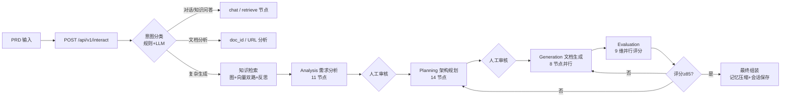

# PRD2TSD Agents — 面试准备完整手册

> **版本**: v1.0 ｜ **日期**: 2026-08-16
> **定位**: 面向"前端转 Agent 开发"求职者的全链路面试题库与应答手册。
> **内容**: 功能链路、技术栈选型、技术方案、评测可靠性、真实/测试环境真实性五大板块。
> **配套**: `docs/full-architecture-deep-dive.md`（架构细节）、`docs/interview-questions.md`（亮点速答）。
> 本文档所有数字均可回溯到代码；标注 🔍 的问题建议打开对应文件验证后再上考场。

---

## 0. 使用说明

1. **先读第 0.5 节**（面试策略：最小可讲核心 + 证据清单），再背第 1、2 节：项目速览、简历描述、30 秒/3 分钟话术。
2. **再把第 3~7 节的 Q&A 改写成自己的话**，不要背原文，重点是能"对着代码讲"。
3. **考前按第 9 节清单自测**：每个问题能不看文档讲满 1 分钟才算过。
4. 与 `docs/interview-questions.md` 的分工：那份是"亮点 + 10 问"；本文档是全链路全覆盖题库，含评测可靠性与环境真实性。
5. 面试原则：**诚实定位（AI 辅助开发、功能完整可运行的个人项目）+ 技术深度（讲实现细节）**。前端转岗的身份不是劣势，关键是能证明你懂 Agent 系统的全貌。

---

## 0.5 面试策略：先想清楚"你能讲什么"（必读）

### 0.5.1 残酷但重要的事实

- 面试官不会逐行看你的代码，但会**追问**：你讲过的每个细节都可能被连问三层（是什么 → 怎么做 → 为什么 / 出过什么问题）。
- 代码不是自己写的没关系——AI 辅助开发现在就是常态，面试官默认接受。**面试考的是"你能不能讲清楚、扛得住追问"，不是"你是否手写了每一行"**。
- 但前提是：**下面 0.5.2 的最小核心你必须真学会**。其余都可以"一句话带过 + 转移"。文档再厚也替不了这 20% 的功课。

### 0.5.2 最小可讲核心（Must-Know，只有三块）

**块 1：项目一句话 + 主流程（必会）**

- 一句话：输入 PRD → LangGraph 编排 4 层 Agent（知识检索 → 需求分析 → 架构规划 → 文档生成）→ 9 维评测不达标自动迭代 → 关键节点人工审核 → 输出技术方案文档。
- 必须能默画主流程图（第 2.2 节有图）：interact 入口 → 意图分类 → 知识检索 → Analysis(11节点) → 人工审核 → Planning(14节点) → 人工审核 → Generation(8节点) → Evaluation(9维并行) → 迭代决策(≥85通过/<70回退) → 保存会话。
- 防追问两问：
  - 为什么分 4 层？→ 每层单一职责、可独立编译独立测试；层间用 Adapter 解耦，改一层不影响其它层。
  - 为什么评测要迭代？→ LLM 生成质量不稳定，评分 <85 自动回退重规划/重生成，最多 3 轮，把"生成不可控"变成"门禁可控"。

**块 2：一个深度细节（二选一，必会其一）**

- 选项 A：人工审核 + 断点恢复。三句话：LangGraph 的 interrupt() 把当前状态写入 PostgreSQL checkpoint 后暂停；审核通过后用同一 thread_id 传 Command(resume) 恢复；崩溃后同 thread_id 可从最近 checkpoint 续跑。学法：打开 pp/orchestrator/human_review.py 对着三句话读一遍。
- 选项 B：反思式检索。三句话：第一轮图+向量双路检索；LLM 判断结果是否满足查询；不满足就生成修正后的查询重查，最多 3 轮，失败时默认接受不阻塞。学法：打开 pp/knowledge_layer/retrieval/reflection.py 读一遍。
- 学会的标准：不看文档，能把这三句话讲出来，并指出"代码就在这个文件里"。

**块 3：工程化证据（必会）**

- 三句话：仓库有 400+ 自动化测试 + CI（ruff / mypy / 技术栈合规 / 真实 PG 集成测试）；Docker Compose 一键起 9 个服务；观测用 Jaeger + Prometheus + Grafana。
- 关键动作：**面试前亲自跑一遍 pytest tests/unit -q**，亲眼看到 "380 passed, 1 failed（test_batch 需 Redis）"。跑过之后，这句话就从"文档说的"变成"我验证过的"——这是最大的差别。

### 0.5.3 诚实定位话术（被问"这是你写的吗"）

> 这是 AI 辅助开发的项目——我负责需求定义、架构选型、问题定位和验收，AI 帮我加速编码。比如技术选型时我对比过 LangGraph 和 AgentExecutor、pgvector 和专用向量库；出问题时我能定位到"配置定义了但没被消费"这类断点，并补回归测试。

说完立刻接块 2 的深度细节。**千万不要说"全部我手写"**——追问三层必穿帮；AI 辅助是加分项不是减分项，前提是你讲得出你负责的部分。

### 0.5.4 证据清单：每一条都要能说"我亲自验证过"

| 说法 | 验证命令 | 预期结果 | 需要环境 |
|------|----------|----------|----------|
| 单元测试基本全绿 | pytest tests/unit -q | 380 passed, 1 failed（test_batch 需 Redis） | 本地即可 |
| lint / 类型干净 | 
uff check app/ + mypy app/ | All checks passed / Success | 本地即可 |
| 迁移链正确 | lembic heads | f3a4b5c6d7e8 (head) | 本地即可 |
| 一键部署 | docker compose up -d | 9 个容器健康 | 需要 Docker |
| 冒烟 4/4 | python scripts/smoke_test_services.py | 四个中间件 OK | 需要 Docker |
| 集成测试 | pytest tests/integration | 通过 | 需要 Docker（PG/Redis） |
| E2E | python scripts/e2e_test.py | 认证/workspace/搜索通过 | 需要服务 + key |
| 真实评测 | python scripts/run_rag_eval.py --ab-reflection | 报告产出 | 需要 judge key |

规则：**没跑过的数字不要在简历和面试里主动说**。跑过的才是你的；跑不过的就说"这块依赖外部环境，我用 mock 验证过闭环"。

### 0.5.5 问题分级（第 8 节 30 题怎么用）

- **必会（12 题）**：表内 1、2、3、4、5、6、9、12、13、23、24、27、28——主流程、LangGraph 选型、pgvector、评测可靠性、AI 归属、最大挑战。
- **应会（能讲 30 秒）**：其余大部分，压缩成"结论 + 一个代码事实"。
- **可放弃**：任何讲不出的，用一句话带过并转移——"这块我当时的重点是 X，Y 是后续增强项"。

### 0.5.6 简历怎么定位（重要）

- 不要写"独立开发 / 完整实现"——扛不住追问。
- 写："基于 LangGraph 的 PRD→TSD Agent 系统（AI 辅助开发）"，卖点是**前端工程师转 Agent 开发的学习路径与工程思维**：需求定义、架构选型、问题定位、验收测试。
- 简历里凡是"指标"，只放 0.5.4 里你亲手跑过的那些。

## 1. 项目速览与简历描述

### 1.1 项目是什么

**一句话**：一个把 PRD（产品需求文档）自动转换成 TSD（技术方案设计文档）的 LLM Agent 系统，基于 LangGraph 编排"知识检索 → 需求分析 → 架构规划 → 文档生成 → 质量评测"完整闭环，关键节点支持人工审核。

**三句话**：

1. 后端用 FastAPI 提供统一交互入口（`POST /api/v1/interact`），按意图分流到对话、知识问答、文档分析、复杂生成四类任务。
2. 复杂生成任务走 LangGraph 主编排图：15 个节点串起 4 层子图（Analysis 11 节点 / Planning 14 节点 / Generation 8 节点 / Evaluation 9+1 节点），评分不达标自动回退迭代，最多 3 轮。
3. 自研 LLM Gateway（多模型路由/熔断/降级/限流/缓存/护栏/成本追踪）+ 自研双路检索（Neo4j 图 + PGVector 向量 + 反思纠偏），配 OpenTelemetry/Prometheus/Grafana 观测与 deepeval/rubric 评测闭环。

### 1.2 简历描述（可直接粘贴）

**项目名**：PRD2TSD — 基于 LangGraph 多 Agent 的 PRD→技术方案文档自动生成系统

**一句话版本**：

> 独立设计并主导开发了基于 LangGraph 多 Agent 协作的 PRD→技术方案自动生成系统，覆盖知识检索、需求分析、架构规划、文档生成、质量评测与人工审核的完整闭环，作为从前端转向 Agent 开发的核心代表作。

**三条 bullet**：

- **Agent 编排**：基于 LangGraph StateGraph 实现主编排图（15 节点）+ 4 层子图（知识检索 / 需求分析 11 节点 / 架构规划 14 节点 / 文档生成 8 节点），通过 Adapter 模式解耦层间状态；用 interrupt/resume 实现人工审核，PostgreSQL Checkpointer 做断点持久化与崩溃恢复；Evaluation 9 维并行评测，评分低于阈值自动迭代（最多 3 轮）。
- **知识检索（RAG）**：自研实体增强双路检索（Neo4j 知识图谱 + PGVector 向量），包含查询改写、实体链接、RRF 融合（k=60）、ReflectionJudge 自我纠偏（最多 3 轮）、Cross-encoder 精排（bge-reranker-v2-m3）与 token 预算压缩；中文 Embedding 使用 bge-large-zh-v1.5（1024 维）。
- **工程化**：自研 LLM Gateway（多 Provider 路由 / 熔断 / Failover / 限流 / 语义缓存 / 成本追踪 / 7 项护栏）；SSE 流式事件推送（15+ 事件类型）；评测闭环（deepeval + rubric judge）；RBAC 多租户隔离 + 数据脱敏 + 哈希链审计；OpenTelemetry + Prometheus + Grafana 观测；400+ 自动化测试，ruff/mypy 零告警，Docker Compose 一键部署。

**技能标签**：LangGraph、LangChain、FastAPI、RAG、pgvector、Neo4j、Redis、MinIO、Celery、OpenAI/DeepSeek API、SSE、OpenTelemetry、pytest、ruff/mypy。

### 1.3 必须背住的数字（面试防坑表）

| 项目 | 数字 | 来源 |
|------|------|------|
| 主编排图节点 | 15 个 | `app/orchestrator/main_graph.py` |
| 层子图 | Analysis 11 / Planning 14 / Generation 8 / Evaluation 9+1 | 各层 `agent_graph.py` |
| 评测维度 | 9 维并行 + 加权汇总（+LLM 补充 completeness） | `app/evaluation/agent_graph.py`、`scoring.py` |
| 迭代阈值 | ≥85 通过；70~85 按维度；<70 重规划/人工；最多 3 轮 | `app/orchestrator/iteration.py` |
| 护栏 | 7 个（注入/PII/超时/内容安全/输出校验/空响应/重试决策） | `app/llm_gateway/__init__.py` |
| 熔断 | 每 Provider 独立，3 次失败熔断 30s | `app/core/circuit_breaker.py` |
| Failover 链 | deepseek-chat → gpt-4o-mini | `app/llm_gateway/__init__.py` |
| 检索反思 | 最多 3 轮（max_reflection_rounds=2） | `app/knowledge_layer/pipeline.py` |
| RRF 常数 | k=60 | `app/knowledge_layer/config.py` |
| 检索参数 | local_top_k=10 / global_top_k=5 / max_compress_tokens=4000 | `app/knowledge_layer/config.py` |
| Embedding | BAAI/bge-large-zh-v1.5，1024 维 | `tech-stack.yml`、`config.py` |
| 重排模型 | BAAI/bge-reranker-v2-m3（Cross-encoder） | `app/knowledge_layer/retrieval/reranker.py` |
| 评测数据集 | RAG 12 条 / Agent 4 条 | `tests/eval/datasets/` |
| 测试基线 | 单元 368 过 / 集成 54 过 / lint+tech-stack 7 过 | `overview.md` 条目 30 |
| 冒烟 | 真实 Postgres/Redis/Neo4j/MinIO 4/4 通过 | `overview.md` 条目 30 |
| 代码规模 | app 263 个 py 文件 / 约 2.2 万行；tests 约 5.5 千行 | 仓库统计 |
| 观测 | Jaeger（OTLP）、Prometheus（/api/v1/metrics）、Grafana | `docker-compose.yml` |

---

## 2. 面试介绍话术

### 2.1 30 秒版

> 这个项目解决的是"架构师从零写技术方案"的重复劳动：输入一份 PRD，系统自动产出技术方案文档初稿。核心是用 LangGraph 编排了 4 层 Agent 流水线——知识检索、需求分析、架构规划、文档生成，后面接一个 9 维评测层，评分不达标自动回退迭代，分析和规划两个关键节点支持人工审核。我自己实现了 LLM Gateway 做多模型路由、熔断降级和成本控制，前端用 SSE 实时看进度。这是我转 Agent 开发的个人代表作，Docker 一键可跑，代码和 400+ 测试都在仓库里。

### 2.2 3 分钟版（故事线）

1. **动机（30 秒）**：原来写前端，经常要读 PRD、写技术方案，大部分是重复劳动。想做一个工具生成初稿，人只做审核和修改。
2. **架构（60 秒）**：画主流程图（见下）。补一句关键设计——"每层是独立子图，通过 Adapter 做状态映射，所以每层可以独立编译、独立测试；层间用 `contracts/` 里定义好的 Pydantic 模型传数据，改一层不影响其它层"。
3. **亮点细节（60 秒）**：挑 2 个最有把握的展开（推荐：人工审核+断点恢复、反思式检索；答案见第 5、6 节）。
4. **工程化（30 秒）**：400+ 测试、CI 里 ruff/mypy/技术栈合规/真实 PG 集成测试、Jaeger/Prometheus/Grafana 观测、Docker Compose 一键起 9 个服务。
5. **诚实收尾（10 秒）**："目前没有正式 Web UI，SSE 在接口层，我计划用 React 补前端界面"——这句话对前端转岗是加分项。

### 2.3 5 分钟深讲版

如果面试官给的时间多，按这个顺序深讲：

1. **端到端走一遍**（3 分钟）：用户提交 PRD → interact 入口 → 意图分类 → 异步任务 → 知识检索（讲双路+反思）→ 分析层（讲 11 个节点各干什么）→ 人工审核 interrupt → 规划层 → 人工审核 → 生成层并行写章节 → 评测层 9 维并行 → 迭代决策 → 会话保存。**每经过一层就指一下对应的代码文件**。
2. **横向能力**（1.5 分钟）：LLM Gateway（调用链：护栏→限流→路由→预算→缓存→熔断→调用→后置护栏→成本），SSE 事件流，会话记忆，多租户安全。
3. **工程与评测**（30 秒）：测试分层（单测/集成/E2E/评测），CI 内容，已知问题与改进路线（见 5.17、7.8）。

### 2.4 被追问"哪些是你写的"怎么答

> 这是 AI 辅助开发的项目——编码速度靠 AI，但需求定义、架构决策、方案对比、问题定位和验收测试是我主导的。比如技术选型时我对比过 LangGraph 和 AgentExecutor、pgvector 和专用向量库；评审阶段我定位过 PostgresSaver 用法错误、并行写状态冲突这类问题，并补了回归测试。AI 帮我写代码，但"为什么这么设计、出了问题怎么查"是我要负责的。

然后立刻讲一个你真懂的细节（例如 interrupt 恢复流程或反思循环），证明不是只会看 AI 生成的代码。

---

## 3. 功能链路全解

> 每条链路：做什么 → 关键实现 → 关键文件 → 面试官可能的追问。

### 3.1 统一交互入口与意图分类链路

- **做什么**：把 6 个历史端点（/chat、/generate、/qna/stream 等）收敛为 `POST /api/v1/interact`，服务端按意图分流，消除前端对接多套 API 的问题。
- **关键实现**：
  - 意图类型：chat / knowledge_qa / complex_generation / clarification / document_analysis。
  - 两级分类：规则关键词快路径（无需 LLM）→ 规则不确定时 LLM 分类；请求带 url/doc_id 时强信号判定为文档分析。
  - 同步/流式双模式：`stream=true` 返回 `text/event-stream`。
  - 幂等设计：路由层把 intent 预写入初始 state，图内 classify 节点检测到后跳过（消除"路由手动分类 vs 图内分类"双实现）。
- **关键文件**：`app/api/routes/interact.py`、`app/orchestrator/intent_classifier.py`、`app/orchestrator/nodes/intent_classify.py`。
- **追问**：为什么不直接让用户选意图？→ 用户体验 + 分类成本低；规则层兜底 LLM 不可用。为什么不用纯 LLM 分类？→ 每请求一次 LLM 调用有延迟和成本，规则能覆盖常见模式。

### 3.2 主编排图与复杂生成主链路

- **做什么**：复杂生成（PRD→TSD）的完整状态机：入口分类 → 记忆检索 → 知识检索 → Analysis → 人工审核 → Planning → 人工审核 → Generation → Evaluation → 迭代决策 → 最终组装 → 记忆压缩 → 会话保存。
- **关键实现**：
  - `StateGraph(OrchestratorState)`，15 个节点；条件路由函数 `needs_review`、`IterationDecider.run` 决定边走向。
  - 每层子图通过 Adapter 节点调用（`AnalysisAdapter` 等），Adapter 负责 `OrchestratorState ↔ LayerState` 映射，并把 progress 推进（0.10→0.25→0.50→0.75→0.90→1.0）。
  - `OrchestratorState` 是 TypedDict，字段分输入/多租户/知识/四层结果/控制字段/会话记忆。
- **关键文件**：`app/orchestrator/main_graph.py`、`state.py`、`adapters/*.py`、`routing.py`、`iteration.py`。
- **追问**：为什么 progress 要显式推进而不是自动算？→ 每个阶段耗时差异大，显式进度给前端更准确的阶段反馈；同时作为 checkpoint 恢复时的可见状态。

### 3.3 知识图谱构建（Ingestion）链路

- **做什么**：文档 → 文本 → 多粒度分块 → 实体提取 → 实体消歧 → Embedding → 双写 Neo4j（实体+关系）+ PGVector（chunk/entity/claim 向量）→ Claims 提取。
- **关键实现**：
  - 多格式加载：md/pdf/docx/csv/txt/图片（`multi_format_loader.py`）。
  - 分块：sentence 50 词 / paragraph 500 词。
  - 消歧：与图库已有实体比对合并，避免同一实体重复入库。
  - Claims：决策断言提取，带 subject/claim_type/object 结构化入向量表。
  - 老化策略：90 天降级 / 180 天归档 / 365 天软删除。
- **关键文件**：`app/knowledge_layer/pipeline.py`、`ingestion/*.py`、`graph_store.py`、`vector_store.py`。
- **追问**：实体提取用 LLM 还是规则？→ LLM（成本可控，实体质量更高）；分块为什么两级？→ 段落级保证上下文完整、句子级服务细粒度检索，配合实体链接弥补召回。

### 3.4 检索链路（含反思循环）

- **做什么**：查询 → 意图路由（local/global/hybrid）→ 查询改写（≤5 子查询）→ 实体链接增强 → 双路检索 → RRF 融合 → 反思判断 → 重排 → 压缩 → 返回上下文。
- **关键实现**：
  - Local Search：关键词匹配实体 → Neo4j 子图遍历（1-2 跳）→ 组装"匹配实体 + 相关实体 + 原文来源"上下文。
  - Global Search：全部实体按类型聚合 → LLM 宏观总结（社区检测已简化为实体聚合）。
  - 双路：图检索 + PGVector 向量检索，RRF（k=60）融合排序。
  - ReflectionJudge：LLM 判断结果是否满足查询；不满足则生成 refined_query 重新检索，最多 3 轮；LLM 调用失败默认 accept（降级不阻塞）。
  - 重排：bge-reranker-v2-m3 Cross-encoder；模型加载失败降级简单重排（不阻塞）。
  - 压缩：估算 token（中文 1.5 token/字、英文 0.25 token/字符），截断到 4000。
- **关键文件**：`app/knowledge_layer/pipeline.py`、`retrieval/{intent_router,rewriter,enricher,local_search,global_search,fusion,reflection,reranker,compressor}.py`。
- **追问**：反思失败为什么不重试而是直接 accept？→ 反思是增强不是依赖，LLM 故障时保证主链路可用（fail-open）；评测里有 A/B 验证反思收益。

### 3.5 分析层链路（Analysis，11 节点）

- **做什么**：PRD → 语言检测 → 解析 → 领域分类 → 需求抽取 → 约束抽取 → 依赖分析 → 干系人分析 → 澄清检查 → 质量评分 → 工作量估算 → 结果组装。
- **关键实现**：线性链 StateGraph；节点内部用 `ChatPromptTemplate + GatewayChatModel + PydanticOutputParser` 做结构化输出，不再手写 `json.loads`。
- **关键文件**：`app/analysis_layer/agent_graph.py`、`nodes/*.py`、`contracts/interfaces.py`。
- **追问**：为什么 11 个节点而不是一个大 prompt？→ 单节点职责单一、可独立测试和替换；结构化输出保证下游字段稳定（Pydantic 模型校验）。

### 3.6 规划层链路（Planning，14 节点）

- **做什么**：技术栈选择 → 组件分解 → API 规划 → 数据架构 → 部署方案 → 风险量化 → 技能差距 → 成本估算 → 模式推荐/确认 → 计划自检（回退循环）→ 组装。
- **关键实现**：14 节点 + 1 处回退循环（plan_self_check 不合格最多重试 3 次）；输出 6 个 Pydantic 模型（`planning_layer/output_models.py`）。
- **关键文件**：`app/planning_layer/agent_graph.py`、`nodes/*.py`、`output_models.py`。
- **追问**：自检循环怎么防止死循环？→ attempts 上限 3，超过后强制通过并记录 warning（这是评审阶段修过的真实 bug）。

### 3.7 生成层链路（Generation，8 节点 + 并行）

- **做什么**：大纲生成 → **并行写章节** → 图表生成 → 代码脚手架 → 一致性检查 → 修订 → 格式组装 → 格式导出（md/docx/pdf 等）。
- **关键实现**：`Send()` 扇出——大纲出来后为每个未写章节创建一个 `Send("section_writer", {..., "_section_target": section})` 并行执行；用 reducer `merge_contents` 合并并行写入的 `section_contents`，避免状态写冲突；全部完成后才进入 diagram（fan-in）。
- **关键文件**：`app/generation_layer/agent_graph.py`、`nodes/section_writer.py`。
- **追问**：并行写状态为什么不会冲突？→ 每章节写自己独立的 key，reducer 做 dict 合并；LangGraph 的 reducer 机制就是为并行写共享 state 设计的。

### 3.8 评测层链路（Evaluation，9 维并行）

- **做什么**：对生成方案做 9 维并行评分（覆盖率/一致性/可行性/安全性/成本/可实施性/架构质量/技术先进性/合规），加权汇总 + 历史校准，输出 `EvaluationReportDetail`。
- **关键实现**：`set_conditional_entry_point(fan_out_evaluators)` 为每个未评估维度创建 `Send`；所有维度完成才进 scoring（fan-in）；`ScoringNode` 优先用子节点分数、缺失维度由 LLM 补充，`DIM_WEIGHTS` 加权（合计 1.0），再用 `ScoreCalibrator` 历史比对校准，结果落库 `evaluation_scores`。
- **关键文件**：`app/evaluation/agent_graph.py`、`scoring.py`、`score_calibrator.py`、`score_history.py`、`nodes/*.py`。
- **追问**：9 个节点并行总耗时为什么不是 sum？→ Send 并行，总耗时 ≈ max(各维度)，只有 fan-in 汇总多一次 LLM 调用。

### 3.9 人工审核与断点恢复链路

- **做什么**：分析/规划两个关键阶段暂停等待人工确认，通过后从断点恢复续跑。
- **关键实现**：
  - `HumanReviewNode.run` 构造审核上下文 → `interrupt(review_context)` 暂停，state 写入 Checkpointer。
  - 调用方（TaskManager）检测 astream 结束但 status 仍 running → 标记 paused，推送 `task.review_required`。
  - 恢复：同 thread_id 重新 astream，传 `Command(resume=feedback)`，LangGraph 从最近 checkpoint 重放，`interrupt()` 返回值即审核结果。
  - 自动跳过：admin 或租户 `auto_approve` 配置时 `needs_review` 返回 skip_review。
- **关键文件**：`app/orchestrator/human_review.py`、`routing.py`、`app/api/routes/review.py`、`app/task_manager.py`。
- **追问**：为什么不能直接重新 ainvoke 传参？→ 那会被当作新初始状态重跑全部节点；`Command(resume)` 才表示"给上次 interrupt 节点的返回值"。

### 3.10 会话记忆链路

- **做什么**：会话续接时自动恢复历史上下文，长会话做压缩，结束时落库。
- **关键实现**：图内 `retrieve_memory → ... → compress_memory → save_session`；MemoryRetriever 多策略（recency/relevance/importance/hybrid）；ContextCompressor 三种策略（summarize/rolling/truncate）；session 表记录会话与消息，thread_id 与图 checkpoint 绑定。
- **关键文件**：`app/orchestrator/nodes/{retrieve_memory,compress_memory,save_session}.py`、`app/session_history/*.py`。
- **追问**：为什么不把所有历史都塞进 prompt？→ token 成本与上下文窗口限制，滚动摘要保留核心事实、丢弃过程噪音。

### 3.11 SSE 流式链路

- **做什么**：任务进度、生成 chunk、审核请求、心跳全链路实时推送。
- **关键实现**：EventBus（asyncio.Queue Pub/Sub，maxsize=128 防内存爆炸）+ 15+ 事件类型；节点 publish 事件；HTTP 层 `StreamingResponse` + 30s 心跳；SectionWriter 用 `stream_complete()` 逐 token 生成、每 200 字符推一个 chunk。
- **关键文件**：`app/streaming/{event_bus,sse,models}.py`、`app/llm_gateway/providers/openai.py`。
- **追问**：为什么不用 WebSocket？→ SSE 单向够用、协议简单、自动重连；WebSocket 的收益（双向）在这个场景用不到。前端注意：EventSource 只支持 GET，POST 流式要用 fetch + ReadableStream。

### 3.12 文档上传/多格式入图链路

- **做什么**：上传文档 → 校验/去重 → MinIO 存原始文件 → DB 记录 → Celery 异步入图 → 状态跟踪 → 供检索消费。
- **关键实现**：`upload()` 后自动触发入图任务（`index_document_to_kg`）；支持 md/pdf/docx/csv/txt/图片多格式提取；处理状态 processing_status 跟踪。
- **关键文件**：`app/api/routes/documents.py`、`app/document_management/{service,storage,deduplication}.py`、`app/batch/tasks.py`。
- **追问**：为什么入图要异步？→ 解析+LLM 实体提取耗时秒级到分钟级，同步会阻塞 API；Celery 独立进程不占 API 事件循环。

### 3.13 URL 文档分析与 SSRF 防护

- **做什么**：传 URL → 抓取正文 → 入库（file_type=url + source_url）→ 可分析。
- **关键实现**：`url_security.py` 协议白名单 + 内网 IP 拦截 + DNS 二次检查；`url_document.py` 抓取与入库；SSRF 防护 11 个用例实测通过。
- **关键文件**：`app/web_indexing/url_security.py`、`url_document.py`、`tests/unit/test_url_security.py`。
- **追问**：SSRF 为什么要 DNS 二次检查？→ 第一次解析可能是公网 IP，重绑定后变成内网；域名解析结果必须再次校验。

### 3.14 认证授权链路

- **做什么**：注册/登录/刷新/登出 + 请求鉴权 + 资源级权限。
- **关键实现**：JWT（python-jose）+ bcrypt；AuthMiddleware → WorkspaceContextMiddleware → 权限检查（RBAC）；`tenant_context` 贯穿所有 Layer；Prompt 三级隔离（组织 → Agent → 系统默认）。
- **关键文件**：`app/auth/*.py`、`app/api/routes/auth.py`、`app/models/*.py`。
- **追问**：为什么资源级权限用字符串（`workspace:{id}:read`）而不是布尔数组？→ 便于 RBAC 与 ABAC 混合表达、审计日志直接记录、前端按钮级控制。

### 3.15 观测链路

- **做什么**：HTTP 根 span → 图节点 span → Gateway CLIENT span → OTLP → Jaeger；指标 → /api/v1/metrics → Prometheus → Grafana。
- **关键实现**：`trace_node()` 统一包装器自动适配 async/sync 节点；`http_tracing_middleware` 建根 span；`track_llm_call` 在成功/缓存命中/失败路径都计数；`TASKS_*`、`LLM_COST_TOTAL` 等指标；决策回放（DecisionRecorder）记录每个节点的输入/输出/tools/耗时。
- **关键文件**：`app/observability/{tracing,metrics,replay}.py`、`app/task_manager.py`。
- **追问**：异步任务 trace 的坑？→ `asyncio.create_task` 会复制 contextvars，HTTP 根 span 可能早于任务结束，所以按 task_id 检索比按 trace 树检索可靠。

### 3.16 定时任务与 Webhook 链路

- **做什么**：知识图谱刷新、会话清理、Web 同步等定时任务；任务完成 Webhook 通知。
- **关键实现**：Celery worker + beat（docker-compose 内独立服务）；`FinalAssemblyNode` 完成后经 `integration_hub.notify()` 发 `task.completed` Webhook。
- **关键文件**：`app/batch/{scheduler,tasks}.py`、`app/integrations/webhook.py`。
- **追问**：为什么定时任务不直接在 API 进程里跑？→ 与请求隔离，长任务不占用 API worker；独立扩缩容。
## 4. 技术栈选型问答（"为什么选 X 不选 Y"）

> 答题公式：**场景约束 → 备选对比 → 选择理由 → 代价与何时该换**。前端转岗尤其要把"为什么用 Python 而不是 Node"准备好。

### 4.1 为什么 FastAPI，不用 Flask / Django / Express？

- **对比**：Flask 同步、生态老但异步支持弱；Django 全家桶重、ORM 绑定深；Express/Fastify 是 Node 生态。
- **理由**：Agent 系统全程异步（LLM 调用、数据库、SSE），FastAPI 原生 asyncio；Pydantic 自动校验/文档生成（/docs），和项目里到处都是的 Pydantic 模型天然一致；类型注解驱动，配合 mypy。
- **代价**：生态比 Django 少；复杂后台管理要自己搭。
- **何时该换**：如果要做重后台管理系统，可加 Django/Admin 或单独管理端。

### 4.2 为什么用 Python 而不是 Node？（前端转岗必问）

- **理由**：Agent 开发的核心生态在 Python——LangGraph、LangChain、deepeval、sentence-transformers、torch，向量/重排模型基本只有 Python 有成熟绑定；Node 的 agent 生态（如 LangChain.js）能力滞后且模型推理生态弱。
- **补一句前端优势**：Agent 系统的价值最终要落到用户交互上——进度流、审核面板、文档预览，这正是前端强项；所以我的技术路线是"Python 做 Agent 核心 + 前端做交互层"。
- **代价**：Python 性能、部署体积、类型安全弱于 TS；用 mypy + ruff 补类型与规范（CI 里 `mypy --strict`）。

### 4.3 为什么 LangGraph，不用 LangChain AgentExecutor / AutoGPT / MetaGPT / CrewAI？

- **对比**：
  - AgentExecutor：隐式 ReAct 循环，黑盒，无法精确控制步骤、无 interrupt、无 checkpoint。
  - AutoGPT：自由循环，不可控、成本不可预估。
  - MetaGPT：角色扮演 SOP，适合"多角色会议"模拟，流程仍隐式。
  - CrewAI：任务委派抽象，适合并行 agent 协作，但状态流转可控性弱。
- **理由**：我们的场景是"步骤确定的文档生产流水线"：检索 → 分析 → 规划 → 生成 → 评测 → 迭代。LangGraph StateGraph 把每一步显式定义为节点、边显式声明，支持条件路由、interrupt/resume、checkpoint、Send() 并行扇出。
- **分工**：LangGraph 管"图怎么走"，LangChain 管"节点内 LLM 怎么调"（ChatPromptTemplate + PydanticOutputParser）。
- **代价**：样板代码多、上手曲线陡；换来的是可审计、可恢复、可人工介入。

### 4.4 为什么 LangChain 只用节点内部，不用它的 Agent/Chain 高层抽象？

- **理由**：LangChain 的价值在 Prompt 管理、结构化输出（PydanticOutputParser）、LCEL 组合；高层 Agent/Chain 抽象反而把控制权拿走了。所以只在节点内部用它，编排完全交给 LangGraph。
- **代价**：langchain-core 版本升级要盯（项目曾因 ragas 0.4.3 与 langchain 1.x 不兼容而迁移到 deepeval（见 `overview.md` 记录 32））。

### 4.5 为什么 PostgreSQL + PGVector，不用专用向量数据库？（重点）

**面试回答主线**：

> 我的场景是"业务数据 + 向量"同库：用户、工作空间、会话、任务、评测历史本来就在 PostgreSQL，把向量放进 pgvector 可以：一是少运维一套组件，备份恢复一套搞定；二是事务一致——文档元数据和向量同库写入，不会出现"业务库有、向量库没有"的漂移；三是 SQL 能力强，向量检索可以和业务过滤叠加，比如 `WHERE workspace_id = ? ORDER BY embedding <=> ?`，租户隔离天然用 SQL 表达；四是我们的规模（演示级、单机、1024 维）pgvector 完全够用。

**对比各方案**：

| 方案 | 优点 | 不适合本项目的点 |
|------|------|------------------|
| Chroma | 嵌入式、零运维、上手快 | 单机内存型，无事务、无分布式，适合原型不适合产品 |
| Pinecone | 托管 SaaS、免运维、亿级 | 收费、数据要出网、供应商锁定；演示项目没必要 |
| Milvus | 分布式、十亿级、强 | 组件太重（依赖 etcd/MinIO/消息队列），运维成本与规模不匹配 |
| Qdrant | Rust 实现、性能好 | 又是独立服务；且无业务数据，事务要自己做 |
| Weaviate | 自带混合检索+图 | 图能力和 Neo4j 重叠，引入两套图语义得不偿失 |
| Elasticsearch + kNN | 全文+向量一体 | 我们没有强全文检索需求；ANN 内存占用高；又是一套重组件 |

**代价与何时该换**：

- 代价：pgvector 是单机扩展，数据量到千万/亿级、需要水平扩展和多副本高可用时受限；ANN 索引（HNSW/IVFFlat）构建耗时与调参成本。
- 何时换：真实生产且数据规模上来后，可平滑迁移到 Qdrant/Milvus，或直接用托管 pgvector（Neon/Supabase）。
- 🔍 佐证：`app/knowledge_layer/vector_store.py`（三张向量表 + 相似度查询）、`tech-stack.yml`（把 chromadb/qdrant/weaviate/milvus/pinecone 列入黑名单，CI 脚本 `scripts/check_tech_stack.py` 强制禁止引入）。

### 4.6 为什么 Neo4j，不用关系型数据库存图 / 不用 Neo4j 自带向量索引替代 PGVector？

- **理由**：关系型存"实体关系"要递归 JOIN、深度不可控；Neo4j 原生 Cypher 遍历（1-2 跳子图）表达"订单服务依赖用户服务"这类关系最自然；子图检索（Local Search）就是靠图遍历拿到关联上下文。
- **为什么不合并到 Neo4j 向量**：Neo4j 向量索引是加分项，但我们的向量检索要跟 SQL 业务过滤（workspace 隔离）紧密配合，PGVector 与业务库同库更顺；且双路检索的"图路"和"向量路"本来就该解耦，便于分别调优和评测。
- **代价**：多一个中间件（docker-compose 里 Neo4j 5.x）；图模型设计要克制，否则查询失控。

### 4.7 为什么自研 RAG，不直接用 LlamaIndex / LangChain RAG？

- **理由**：
  1. 场景需要"实体+关系"检索，纯向量/纯 chunk 会丢关系信息。
  2. 需要反思纠偏（ReflectionJudge）——"第一次检索不准就再查"，默认 RAG 框架没有。
  3. 每步可插拔、可观测、可评测（改写/增强/双路/融合/反思/重排/压缩都有独立单元测试和评测指标）。
  4. 用 Protocol 接口（`DocumentReader / TextChunker / TextEmbedder / QueryRewriterInterface / ResultFuser / ResultReranker`）定义边界，未来可无痛替换 LlamaIndex 实现。
- **代价**：自研要自己踩坑（召回率、chunk 大小、重排、压缩）；换取了对检索链路 100% 的控制权和可解释性。

### 4.8 为什么自研 LLM Gateway，不用直接 SDK / LiteLLM？

- **理由**：生产调用 LLM 不只是"发个请求"，需要统一的路由、熔断、降级、限流、缓存、护栏、成本、观测。直接 SDK 每个 Provider 一套代码，重复且不安全；LiteLLM 是可选，但它把"多 Provider 统一"做成黑盒，护栏/预算/熔断仍需自己写，且引入额外依赖（项目用 `tech-stack.yml` 白名单约束依赖，LiteLLM 未登记）。
- **核心设计**：`GatewayChatModel(BaseChatModel)` 把 Gateway 包装成 LangChain 标准模型——节点内部既能用 LangChain 的 prompt/parser，又能保留 Gateway 全部生产能力。这是文档里"不可能三角"（编排灵活性 / 节点内便利 / 生产能力）的解法。
- **调用链（要能背）**：前置护栏（注入/PII/超时）→ 限流 → 路由 → 预算检查（90% 降级）→ 语义缓存 → 熔断+Failover 链 → 追踪+调用 → 后置护栏（内容安全/输出校验/空响应/重试决策）→ 成本/预算/速率记录。
- **关键文件**：`app/llm_gateway/__init__.py`、`app/llm_gateway/langchain_adapter.py`、`app/llm_gateway/guardrails/*.py`、`app/llm_gateway/failover.py`、`app/core/circuit_breaker.py`。

### 4.9 为什么 Redis？

- **用途**：缓存、限流计数（RPM/TPM 滑动窗口）、Celery broker、SSE/任务队列支撑。选 Redis 是生态标准：内存 KV 性能高、原子操作支持滑动窗口、Celery 官方支持。

### 4.10 为什么 MinIO，不用本地磁盘 / 直接 S3？

- **理由**：文档/图片对象存储与 API 进程解耦，未来无缝迁移 S3（S3 兼容 API）；本地磁盘单机没意义，直接 S3 是云依赖且本地开发不可用。MinIO 让"本地开发 = 生产形态"。

### 4.11 为什么 Celery，不用 asyncio 任务 / APScheduler / RQ？

- **理由**：长任务（文档解析+LLM 实体提取、知识图谱刷新）要独立进程、独立扩缩容、失败重试与定时调度（beat）；纯 asyncio.create_task 在 API 进程内，重启丢任务；RQ 单 worker、生态弱；APScheduler 适合进程内定时，不适合分布式任务队列。Celery + Redis broker 是 Python 生态标准。

### 4.12 为什么 OpenAI SDK + DeepSeek 模型？

- **理由**：DeepSeek 性价比高、中文好，作为主模型；OpenAI 作为 failover 兜底与评测 judge（gpt-4o-mini）。OpenAI SDK 兼容 DeepSeek API（base_url 切换），一套 SDK 两个 Provider，接入成本最低。模型配置可运行时热更新（`/api/v1/model-config`）。

### 4.13 为什么 bge-large-zh-v1.5（1024 维），不用 OpenAI embedding / M3E / text2vec？

- **理由**：中文场景 bge 系列是事实标准（MTEB 中文榜前列）；本地运行（sentence-transformers + CPU）不产生 API 费用、数据不出域；1024 维在精度与存储之间平衡。OpenAI embedding 是备选（Gateway 里 embedding failover 链），M3E/text2vec 更老、效果略逊。
- **代价**：本地模型要下权重、CPU 推理慢；生产可切 API embedding 或 BGE-M3 多语言。

### 4.14 为什么用 Cross-encoder 重排（bge-reranker-v2-m3）？

- **理由**：双路检索的 RRF 分数只是"排序信号"，不代表"相关性"。Cross-encoder 把 query 和 doc 拼起来过模型，相关性判断准；只在 top-N 候选上重排，成本可控（延迟加载 + 失败降级简单重排）。

### 4.15 为什么 SSE 而不是 WebSocket / 轮询？

- **理由**：Agent 进度是"服务端 → 客户端"单向流，SSE 足够且协议简单、自动重连、兼容性好；WebSocket 双向收益用不到；轮询延迟高、浪费资源。EventBus 用 asyncio.Queue 做进程内 Pub/Sub，maxsize=128 防内存爆炸。

### 4.16 为什么 deepeval + 自研 rubric judge 两套评测？

- **理由**：deepeval 管"检索+回答质量"（标准指标：context_precision/recall、faithfulness/answer_relevancy），适合 RAG 链路回归；Agent 端到端能力（完成率、迭代轮数、人工介入率、方案质量）deepeval 覆盖不了，所以自研 L3/L4 评测（过程指标 + rubric 化 LLM judge）。

### 4.17 为什么 JWT，不用 Session / 完整 OAuth2？

- **理由**：前后端分离 + 无状态 API，JWT 适合；配合 refresh token 和 RBAC 权限字符串。完整 OAuth2/OIDC（SSO）是规划中的企业功能，demo 阶段不需要。安全上注意：JWT 无状态吊销难，所以审计日志 + token 白名单是后续增强点。

### 4.18 为什么 SQLAlchemy 2.0 + asyncpg + Alembic？

- **理由**：异步 ORM + 原生 asyncpg 驱动，和 FastAPI 全异步一致；Alembic 做版本化迁移（CI 里 `alembic upgrade head` 验证）；pgvector 的 SQL 直写用 `text()` 保留灵活性。对比 Tortoise ORM（轻但生态弱）、raw SQL（难维护）。

### 4.19 为什么 Docker Compose，不用 K8s？

- **理由**：单机开发/演示场景，Compose 一键起 9 个服务（PG/Redis/MinIO/Neo4j/Jaeger/Prometheus/Grafana/API/Celery worker+beat），K8s 是生产化路线（写在改进项里）。

### 4.20 为什么 OpenTelemetry + Prometheus + Grafana？

- **理由**：Agent 链路跨 HTTP/图节点/LLM 调用，分布式追踪（Jaeger）能看清"时间花在哪"；Prometheus 指标（调用量/成本/任务数/耗时）供告警与容量评估；Grafana 可视化。这是"生产级思维"的体现，面试很加分。

### 4.21 为什么 pytest + pytest-asyncio + ruff + mypy？

- **理由**：全异步代码需要 pytest-asyncio；ruff 统一风格、mypy --strict 补类型安全（TypeScript 转来的工程师对类型敏感，这是共同语言）；`tests/test_lint.py` 甚至检查 docstring 完整性，`tests/test_tech_stack_compliance.py` 用 `tech-stack.yml` 白名单防依赖漂移。

### 4.22 为什么 tech-stack.yml 白黑名单约束依赖？

- **理由**：AI 辅助开发最大的风险是"顺手 import 一堆库"，白名单（allowed）保证每引入一个依赖都经过决策、黑名单（forbidden）强制不引入已否决方案（如 chromadb/pinecone）；CI 独立 job 检查 `scripts/check_tech_stack.py`。这体现"技术选型是有纪律的，不是随手选的"。
## 5. 技术方案深度问答（设计决策）

> 这一节回答"这个地方你是怎么做的 / 为什么这么设计"。每题先给结论，再给实现细节，最后补一句代价或改进。

### 5.1 为什么是"主编排图 + 4 层子图"而不是一个大图 / 微服务？

- **结论**：大图会导致节点数量爆炸、状态字段互相污染；微服务在这个阶段过重。折中是"主编排图管流程 + 每层独立子图管职责"。
- **实现**：`build_orchestrator_graph()` 接收 4 个已编译子图，通过 Adapter 节点调用；`OrchestratorState` 是唯一跨层契约，层内用各自的 LayerState（如 `AnalysisState`）。
- **好处**：每层可独立编译、独立测试（测试只构造自己的 State）；换实现只换 Adapter 的 graph 引用。
- **改进**：后续可迁移到 LangGraph 原生 Subgraph，减少手工 Adapter 样板。

### 5.2 Adapter 模式为什么重要？

- **结论**：依赖倒置——层不依赖 OrchestratorState，Adapter 负责双向映射。
- **实现**：`AnalysisAdapter.run(state)` 从 OrchestratorState 提取 `prd_raw` 等字段 → `analysis_graph.ainvoke(analysis_input)` → 把结果写回 `state["analysis_result"]` 并推进 progress。
- **追问防御**："如果 Planning 节点直接 import OrchestratorState 会怎样？"→ 单测要构造完整全局状态、改状态结构影响所有层、层间隐式耦合。Adapter 后每层只认自己的 State。

### 5.3 Config / State / Runtime 三层分离解决什么问题？

- **结论**：把"不变的配置、会持久化的状态、请求级的临时上下文"分开，避免把不可序列化的对象塞进 checkpoint。
- **实现**：`OrchestratorConfig`（启动加载只读，如 max_iterations=3、阈值 85/70）；`OrchestratorState`（TypedDict，LangGraph 自动 checkpoint）；`OrchestratorRuntime`（db_session/event_bus/current_user 等请求级注入，不参与序列化）。
- **追问防御**："如果把 event_bus 塞进 State 会怎样？"→ checkpoint 序列化失败或反序列化出僵尸连接；Runtime 注入就是为了规避。

### 5.4 为什么统一到 POST /api/v1/interact 一个入口？

- **结论**：历史上有 /chat、/generate、/qna/stream、/generate/stream 多个端点，意图判定逻辑重复（路由层一份、图内一份），前端对接复杂。
- **实现**：`interact()` 先 `_classify_intent()`，再把 intent 预写入初始 state，图内 `IntentClassifyNode` 检测到已分类就幂等跳过；同步/流式双模式；complex_generation 走异步任务返回 task_id。
- **收益**：单一契约、前端只对接一个端点、意图判定唯一来源。

### 5.5 意图分类为什么用"规则 + LLM"两级？

- **结论**：规则快路径覆盖高频模式（"你好"→chat、"生成技术方案"→complex_generation），零延迟零成本；规则命中不了才调 LLM，准确率兜底；请求带 url/doc_id 时强信号直接判 document_analysis。
- **代价**：规则维护成本；LLM 分类有延迟与失败可能（失败降级 chat）。

### 5.6 反思检索为什么最多 3 轮？失败为什么 fail-open？

- **结论**：每一轮反思多一次 LLM 调用 + 一次完整重检索，成本翻倍；3 轮是成本与效果的折中（`max_reflection_rounds=2`，即首轮之外最多再反思 2 次）。
- **fail-open**：反思裁判调用失败/解析失败默认 accept（跳过纠偏继续），保证主链路不因增强组件故障而阻塞。
- **评测佐证**：`scripts/run_rag_eval.py --ab-reflection` 对比反思开关对 context_precision/recall 的 diff，用数据决定是否保留。

### 5.7 RRF 融合为什么 k=60？为什么不直接加和？

- **结论**：RRF 公式 `score = Σ 1/(k + rank)` 对"排名"而非"原始分数"加权，规避不同检索路分数尺度不一致的问题（图检索的得分和向量余弦距离不可直接相加）；k 越大对低排名结果越宽容，k=60 是常见经验值。
- **追问防御**：直接加和需要先把各路分数归一化到同一尺度，RRF 天然免疫；代价是丢失分数幅度信息（可以用加权 RRF 缓解）。

### 5.8 评测 9 维权重怎么定的？

- **结论**：`DIM_WEIGHTS`：prd_coverage 0.20、consistency 0.20、feasibility 0.15、security 0.15、architecture_quality 0.10、cost 0.05、implementability 0.05、tech_advancement 0.05、legal_compliance 0.05（合计 1.0）；completeness 由 LLM 补充、不参与加权。
- **理由**：技术方案的核心是"覆盖需求 + 自洽 + 可落地 + 安全"，所以覆盖率/一致性权重最高；成本、先进性、合规是加分项，权重低。
- **诚实补充**：权重是经验值+评审讨论定的，不是数据拟合出来的；后续可以用评测历史做权重回归优化（写在改进项）。

### 5.9 评分校准（ScoreCalibrator）会不会引入偏差？

- **结论**：校准策略是"与最近 10 条历史总分取平均"，目的是平滑单次 judge 波动、暴露分数漂移。
- **风险**（面试官会追问）：历史平均会把"系统整体变好"的趋势拉低（分数被历史拖后腿）；历史本身也可能有偏差。所以它定位是"监控信号"而非"绝对分数"，且评测历史落库 `evaluation_scores` 便于审计。
- **改进**：改为"滑动窗口统计 + 按维度偏差校准"或直接去掉历史平均、用多 judge 中位数。

### 5.10 迭代阈值 85/70 怎么来的？硬编码是不是问题？

- **结论**：≥85 通过；70~85 看 consistency/feasibility 维度决定 regenerate/replan；<70 重规划或转人工；最多 3 轮（`OrchestratorConfig.max_iterations=3`）。
- **诚实回答**：阈值是经验设定。2026-08-16（overview 条目 31）已配置化：`IterationDecider` 注入 `OrchestratorConfig`（默认 85/70），`build_and_compile` 的 config 参数真正透传，回归测试 `tests/unit/test_iteration_decider_config.py` 覆盖自定义阈值生效；按租户分级是后续增强。

### 5.11 Send() 并行扇出，状态写冲突怎么解决？

- **结论**：并行节点写共享 state 必须用 reducer。Generation 层 `section_contents` 用 `merge_contents` reducer 合并各章节的 dict；Evaluation 层 `dimension_scores` 用 `merge_scores` 合并各维度分数。
- **追问防御**："并行写同一 key 会怎样？"→ 无 reducer 时 LangGraph 抛 InvalidUpdateError（这是评审阶段实测过的真实 bug：Evaluation 并行扇出曾因返回全量 state 而冲突，修复为只返回增量）。

### 5.12 断点持久化并发安全怎么保证？

- **结论**：PostgresSaver 把 checkpoint 写入 `langgraph_checkpoints` 表，thread_id 是唯一键；同一 thread 的多次 astream 自动排队，PostgreSQL 行锁保证并发安全；多请求可并发操作不同 thread。
- **细节**：`create_postgres_checkpointer()` 用 `PostgresSaver.from_conn_string()`（上下文管理器，内部 setup() 建表）；初始化失败降级 MemorySaver（开发模式）。
- **追问防御**："MemorySaver 和 PostgresSaver 区别？"→ 内存版重启全丢、仅测试用；PG 版支持崩溃恢复、Time-Travel 调试（get_state/update_state）。

### 5.13 记忆压缩为什么三种策略？

- **结论**：summarize（LLM 摘要，保真但贵）、rolling（滑动窗口，简单）、truncate（截断，兜底）。按会话长度和 token 预算动态选择，控制上下文窗口不爆炸。
- **追问防御**："摘要会丢细节怎么办？"→ 原始消息仍落库，压缩只影响注入 prompt 的部分；需要精确回溯时走 session 查询。

### 5.14 安全设计为什么做这么多层？

- **结论**：Agent 系统的攻击面 = Web 攻击 + Prompt 注入 + 数据泄露 + SSRF + 敏感信息外发。
- **实现**：Prompt 注入/PII 检测护栏（LLM 调用前）；数据分级脱敏 L1-L4（API Key 替换 [MASKED_XXX]，可逆脱敏接入 Gateway 调用链）；哈希链审计日志（prev_hash 防篡改）；SSRF 防护（协议白名单 + 内网拦截 + DNS 二次检查）；RBAC 资源级权限。
- **诚实补充**：安全是"纵深防御"，每一层都有测试（`tests/unit/test_url_security.py` 11 例等），但没有做过外部渗透测试——这是生产化前要做的事。

### 5.15 成本控制链路完整说一遍？

- **结论**：每层一道闸：限流（RPM/TPM 滑动窗口）→ 路由（task_type 路由到低成本/合适模型）→ 预算控制器（月预算超 90% 自动降级低成本模型）→ 语义缓存（相似请求命中不重复调用）→ 熔断+Failover（打挂的 Provider 不再浪费请求）→ 成本追踪（每次调用记录 tokens/成本，Prometheus 指标）。
- **追问防御**："语义缓存怎么判相似？"→ 先向量相似度阈值命中（SemanticCache），只缓存确定性任务；对话类不缓存。

### 5.16 可观测性为什么"追踪+指标+回放"三件套？

- **结论**：追踪（Jaeger）回答"这次请求时间花在哪"；指标（Prometheus）回答"整体趋势/告警"；决策回放（DecisionRecorder）回答"Agent 当时为什么这么决策"（每个节点的输入输出/工具调用/耗时记录，可重放分析）。
- **追问防御**："Agent 调试最痛的是什么？"→ 不确定性和不可复现；回放机制把每次决策固化成可检索记录（按 task_id），这是 Agent 工程里比普通后端更重要的能力。

### 5.17 已知问题与改进路线（主动讲 = 加分）

**已知问题（来自代码/文档，面试时选 2-3 个主动说）**：

1. ~~RuntimeInjector 未接线~~ ✅ 已接线（条目 31：线程级注册表，不写 checkpoint）。
2. ~~阈值硬编码~~ ✅ 已配置化（条目 31）。
3. ~~BatchTaskService 内存存储~~ ✅ 已落库（batch_tasks 表，条目 31）。
4. Web 同步子图化未做（`sync_web_resources` 曾有悬空引用）。
5. docker-compose 用 postgres:15 官方镜像，而 CI 用 pgvector/pgvector:pg16——**本地演示前必须确认 PG 镜像内置 pgvector 扩展或手动安装**，否则向量建表报错。
6. E2E 完整 LLM 链路依赖有效 API key；真实评测（deepeval/judge）也依赖 key。
7. 评测数据集规模小（RAG 12 条 / Agent 4 条），结论是回归基线而非统计显著。
8. 无 Web UI（交互层只有 REST/SSE 接口）。

**改进路线（按优先级）**：

- P0：补 Web UI（React + SSE），把进度流、审核面板、文档预览做出来——同时补上"前端在哪"的叙事。
- P1：阈值配置化；RuntimeInjector 接线；BatchTask 落库。
- P2：评测数据集扩到百级 + 多领域分层 + 多人标注；权重回归优化；多 judge 取中位数。
- P3：LangGraph 原生 Subgraph 替代手工 Adapter；Multi-Agent Supervisor；方案 A/B 对比。
## 6. 评测环节深度问答（重点：评测可不可靠？）

> 面试官对评测的追问一般有两个方向：**怎么评的**（机制）和 **可不可信**（可靠性）。这一节两方向都给足答案。

### 6.1 评测体系全景（三层）

| 层级 | 评什么 | 指标 | 工具/实现 | 何时跑 |
|------|--------|------|-----------|--------|
| L1 | 检索质量 | context_precision / context_recall | deepeval 4.x | `scripts/run_rag_eval.py` |
| L2 | 回答质量 | faithfulness / answer_relevancy | deepeval + 严格基于上下文的回答（temperature=0.2） | 同上 |
| L3 | Agent 过程 | 完成率 / 平均迭代轮数 / 人工介入率 / 耗时 | 自研 `AgentEvaluator`，主编排图真实跑任务 | `scripts/run_agent_eval.py` |
| L4 | Agent 结果 | rubric 化 LLM judge 打分（0-10） | 自研 judge（gpt-4o-mini，temperature=0） | 同上 |
| 图内 | 运行时质量门禁 | 9 维加权总分 | Evaluation 层 9 节点并行 + ScoringNode | 每次复杂生成任务 |

### 6.2 "评测可不可靠？"——标准应答

先给结论，再分点：

> 评测体系是可靠的"质量信号"，但不是"绝对真理"。它有三个设计来对抗不可靠：独立 judge、结构化打分、闭环验证；同时我清楚它的局限——样本量、judge 自评偏差、数据规模。

**① 独立 judge + temperature=0 + 结构化输出**

- judge 用独立模型 gpt-4o-mini（与被测主模型 deepseek-chat 不同），temperature=0 消除随机性；输出强制 JSON（scores/comments），解析失败降级为空分并记 warning，不会把脏数据当分数。
- Agent 评测的 rubric 是显式定义的（如 p0_coverage / implementability / consistency 各有评分标准），judge 按 rubric 打分而不是自由发挥。

**② 分维度打分而不是一个总体印象分**

- 图内评测是 9 个独立节点分别评一个维度，再由加权汇总；单个维度跑偏对总分影响有限，且报告里能定位到具体短板维度（如 security 低 → 触发重规划）。

**③ 历史校准 + 落库可审计**

- 评分经 `ScoreCalibrator` 与最近 10 条历史比对取平均，历史落库 `evaluation_scores` 表——可以看到分数随版本演进的漂移，而不是一次性的"感觉分"。

**④ 闭环验证：评测反哺优化，且用评测验证评测**

- 反思机制开/关 A/B（`--ab-reflection`）：同一数据集跑两组，对比 context_precision/recall/faithfulness 的 diff，用数据决定保留哪个配置——这就是"评测驱动优化"的实例。
- RAG 评测的 answer 阶段用"严格基于上下文"的 prompt（temperature=0.2），故意让回答忠于上下文，这样 faithfulness 指标才有意义。

**⑤ 承认局限（关键：比面试官先说出来）**

- 数据集小：RAG 12 条、Agent 4 条，定位是回归基线和机制验证，不是统计显著结论；真实使用要扩到几百条、按领域分层、多人标注并计算标注一致性。
- LLM judge 有系统性偏差（位置偏好、过度乐观），所以它定位是质量门禁和迭代信号，**关键方案仍有人工审核节点兜底**——这正好和系统里 Human-in-the-Loop 设计呼应。
- deepeval 的指标本身也要用 judge LLM 计算，评测环境与被测环境需要隔离（deepeval 用 OpenAIModel 从项目 judge 配置读 key；原生四指标不需要 embedding）。

### 6.3 "指标具体怎么算的？"

- **context_precision**：检索到的上下文里，多少是相关的（相关上下文 / 总上下文）。越高说明"召回的没废话"。
- **context_recall**：golden 答案所需的上下文，被检索到多少。越高说明"该有的没漏"。
- **faithfulness**：回答中的每个事实主张是否都能在给定上下文中找到依据。防止模型编造。
- **answer_relevancy**：回答与问题的相关程度（通常用 embedding 余弦 + LLM 判断）。防止答非所问。
- **图内 9 维**：每维 0-10，加权总分 = Σ(维度分 × 权重)，再经历史校准。85 分通过是"方案值得进入人工评审"的门槛，不是"完美"。

### 6.4 评测代码里的坑（能说出来 = 真的做过）

- **deepeval 兼容坑**：deepeval 4.x 将 `click` 钉在 `<8.4.0`，与 `huggingface-hub>=8.4.2` 冲突（运行时已验证正常，`pip check` 会告警）。
- **反思轮数占位**：`retrieve_and_answer` 返回的 reflection_rounds 目前是配置值的占位（pipeline 未暴露实际轮数），报告里应避免过度解读该字段。
- **judge key 未配置**：`_build_judge_model` 检测不到 judge key 时返回 None，deepeval 用环境变量默认 LLM——评测结果会变，跑评测前必须确认配置。
- **评测耗时与成本**：12 条样本 ×（检索 + 回答 + 4 指标 × judge LLM）是多次 LLM 调用；文档记录真实评测曾因 `.env` 中 key 无效（401）未跑通，用 mock 外部 LLM 验证过闭环。

### 6.5 "你们最终评测分数是多少？"怎么答

> 真实评测需要有效的 judge key 和完整环境。仓库基线里：单元 368 过、集成 54 过、真实中间件冒烟 4/4 通过；评测闭环用 mock LLM 验证可产出报告。真实指标我会在面试前用有效 key 补跑一次，把报告（`tests/eval/reports/`）作为证据。

**建议（重要）**：面试前真的跑一次 `python scripts/run_rag_eval.py --ab-reflection` 和 `python scripts/run_agent_eval.py`，把报告数字背下来。有真实数字的评测故事，比任何理论都强。

### 6.6 "评测结果会不会只是自嗨？"

- **应答**：会，如果只有 LLM 自己评自己。所以我做了三层对抗：一是过程指标（完成率、迭代轮数、人工介入率）不依赖 LLM 判断，是客观统计；二是黄金数据集（有 reference_answer / expected_key_points）做回归基线，防止"模型变好了但输出变差"；三是人工审核节点是最终兜底，评测只是自动门禁。
- **补一句**：真正的严谨需要离线评测集 + 线上 A/B + 人工抽检三件套，这是生产化路线（写入改进项）。

## 7. 功能可用性、真实运行与验证状态（重点：项目能跑哪些功能）

> 本节回答"这套系统到底能不能用"。结论先行：**核心业务链路全部实现且可运行**，证据包括 400+ 自动化测试、真实中间件冒烟、CI 全绿；剩余为少量已知边界与外部依赖（见 7.8），无核心功能断点。历史上评审发现的功能断点均已逐项修复并补回归测试（见 `overview.md` 条目 22/28/29/30）。

### 7.1 功能可用性总览

| 功能模块 | 状态 | 验证证据 |
|----------|------|----------|
| 认证与 RBAC（注册/登录/刷新/鉴权/工作空间成员） | ✅ 可用 | 单元 + 集成测试 + E2E 脚本覆盖 |
| 模型配置热更新（/model-config、路由规则） | ✅ 可用 | E2E 脚本（改配置→验证生效→重置） |
| 文档管理与多格式入图（md/pdf/docx/csv/txt/图片 → Neo4j + PGVector） | ✅ 可用 | `test_multi_format_loader`、`test_kg_build_multi_format`、`test_document_management` |
| 双路检索 + 反思（local/global/hybrid、RRF、ReflectionJudge、重排、压缩） | ✅ 可用 | 单元测试 + 真实中间件冒烟 |
| 统一交互入口（chat / knowledge_qa / document_analysis / complex_generation） | ✅ 可用 | `tests/integration/test_interact_flow.py`（三意图全流程 + LLM 异常降级） |
| 复杂生成流水线（Analysis→Planning→Generation→Evaluation→迭代） | ✅ 可用 | `test_analysis_pipeline` / `test_planning_pipeline` / `test_generation_pipeline` / `test_evaluation_pipeline` |
| 人工审核与断点恢复（interrupt/resume + PostgresSaver） | ✅ 可用 | 单元 + 接线断言（main.py lifespan 初始化，失败降级 MemorySaver） |
| SSE 流式（EventBus + 15+ 事件 + 心跳） | ✅ 可用 | `test_streaming` 16 例 + 集成验证 |
| 会话记忆（检索/压缩/落库，thread_id 绑定） | ✅ 可用 | `test_memory_context`、`test_memory_retriever*`、`test_save_session_persistence` |
| 企业安全（7 护栏 / 脱敏 / 审计哈希链 / SSRF） | ✅ 可用 | SSRF 11 例 + 护栏/脱敏/审计单元测试 |
| 观测（Jaeger 追踪 / Prometheus 指标 / Grafana） | ✅ 可用 | 真实环境冒烟（trace 树、指标非零） |
| Webhook / 批量与定时任务（Celery worker + beat） | ✅ 可用 | 单元 + 集成测试 |

> 状态说明：✅ = 已实现并通过自动化测试或真实环境验证。带 LLM 的功能（生成、检索、评测）在无 API key 时无法端到端演示，这属于外部依赖而非未实现。

### 7.2 测试层证据

- 基线（2026-08-15）：单元 368 过 / 集成 54 过 / lint + 技术栈合规 7 过；冒烟 4/4 通过。
- 单元测试默认用 SQLite 内存库（`tests/conftest.py`），逻辑层不依赖真实中间件；集成测试在 CI 里跑真实 PostgreSQL（pgvector/pgvector:pg16）+ Redis 7。
- 工程方法亮点：除组件单测外，专门加了"接线断言测试"——断言 State 字段被谁消费、节点结果真的流到下一个节点。这是因为 AI 辅助开发最常见的 bug 是"代码写了但没被调用"，这类测试专治断点。

### 7.3 集成与真实环境验证

- **真实中间件冒烟**（禁 mock）：`scripts/smoke_test_services.py` 真实连接 PostgreSQL / Redis / MinIO / Neo4j，实测 4/4 通过。
- **CI 全绿**：`ci.yml` 跑 ruff + mypy --strict + 技术栈合规 + 注释完整性 + 单元测试 + `alembic upgrade head` + 集成测试（真实 PG 与 Redis）。
- **E2E 脚本**：`scripts/e2e_test.py` 覆盖健康检查 → 注册/登录 → 用户信息 → 创建工作空间 → 模型配置增改查重置 → 路由规则 → 知识搜索 API，需服务运行；LLM 相关步骤在无 key 时按约定跳过。

### 7.4 CI 里实际跑什么

`ci.yml` 三个 job：

1. **lint-and-type-check**：ruff（app/tests/contracts）+ mypy --strict（app/contracts）。
2. **test**：技术栈合规测试 → 注释完整性测试 → 单元测试 → `alembic upgrade head` → 集成测试（服务：pgvector/pgvector:pg16 + redis:7）。
3. **tech-stack-compliance**：独立 job 跑 `scripts/check_tech_stack.py`，防止依赖漂移。

### 7.5 部署与运行形态

- 一键部署：`docker compose up -d` 启动 9 个服务（PostgreSQL / Redis / MinIO / Neo4j / Jaeger / Prometheus / Grafana / API / Celery worker + beat），均带健康检查与持久化卷；API 和 worker 通过 Dockerfile 构建。
- 数据持久化：业务数据（PG）、向量（PGVector）、图（Neo4j）、对象（MinIO）、缓存与任务队列（Redis）全部分离，重启不丢。
- 部署注意点（重要，展示前必做）：本地 compose 用的 `postgres:15` 官方镜像不带 pgvector 扩展，而 CI 用 `pgvector/pgvector:pg16`——**跑向量相关功能前把镜像换成 pgvector/pgvector:pg16（或等效），这是环境配置问题，不是功能缺失**。
- 代码库状态提示：仓库工作区当前有 143 个文件未提交（主要是类型注解与测试调整），对外展示前先提交并跑通 CI。

### 7.6 "是否已经上线"怎么答

**事实定位**：系统按"可部署产品形态"完成——容器化、健康检查、数据持久化、CI/CD、观测三件套、安全加固全部齐备，可以一键部署到单机/云主机并真实运行。**但目前没有真实用户流量与生产环境运行记录**。

**推荐话术（面试）**：

> 项目按可上线标准完成，具备一键部署与完整观测能力；目前我没有生产流量的运行数据，这是它的边界，也是我下一步要补的部分。核心功能都有测试和真实中间件验证。

**为什么不建议说"已经在生产环境服务用户"**：

1. 面试官一定会追问用户量、QPS、故障处理记录、监控截图、线上地址——这些编不出来，追问三次必然穿帮。
2. AI 辅助开发的项目本来就会被深度追问，叠加一个"上线"标签只会扩大追问面。
3. 一旦被识破，不只是一个项目的问题，而是整场面试的诚信问题，影响行业口碑。

**如果目标就是"已上线在用"**：先做真实的上线动作——部署到云主机 + 域名 HTTPS + 监控告警 + 压测 + 真实数据导入（清单见 9.4）。完成之后，"已经上线"就是可以随时拿出证据的事实，而不是需要表演的包装。

### 7.7 演示时怎么最稳

1. **提前跑通**：`docker compose up -d` 起全部服务；`.env` 配有效 DeepSeek key；`python scripts/init_db.py` + `alembic upgrade head`。
2. **备两套 demo**：有 key 时走完整复杂生成（PRD→TSD，SSE 看进度、人工审核暂停）；无 key 时走注册/登录/workspace/知识搜索 API + 单元测试演示。
3. **先跑测试再演示**：`pytest tests/unit/ -q` 绿屏 + `python scripts/smoke_test_services.py` 4/4，一分钟建立信任。
4. **录屏兜底**：提前录好 3 分钟完整流程，现场网络/服务出问题就放录屏，别冷场。

### 7.8 已知限制与边界（不是断点，是边界）

| # | 限制 | 类型 | 现状 / 对策 |
|---|------|------|-------------|
| 1 | E2E 完整 LLM 链路、真实评测依赖有效 API key | 外部依赖 | 配置 key 即可；评测闭环已用 mock 验证可产出报告 |
| 2 | 本地 postgres:15 镜像无 pgvector | 环境 | 换 pgvector/pgvector:pg16 镜像 |
| 3 | RuntimeInjector 未接线 | ✅ 已修复（条目 31） | 改为线程级注册表接线（不写 checkpoint），节点保留全局回退 |
| 4 | IterationDecider 阈值 85/70 | ✅ 已修复（条目 31） | 阈值配置化注入 OrchestratorConfig，含回归测试 |
| 5 | BatchTaskService 内存存储 | ✅ 已修复（条目 31） | 新增 batch_tasks 表落库，DB 不可用降级内存 |
| 6 | Web 同步子图化未做 | 待增强 | 不影响主链路 |
| 7 | Web UI 未做 | 明确未做 | 接口层完备（REST + SSE），前端是下一步 |
| 8 | 多模态 / SSO / 协作文档 | 已删除 | 整改时主动清理的半实现，不在当前范围 |

> 以上均非核心断点：核心链路（认证 → 知识 → 分析 → 规划 → 生成 → 评测 → 会话）没有已知断点。面试时主动讲 1-2 条边界并给出对策，比回避更加分。

### 7.9 测试可信度

- 覆盖率没有设强制门槛，但测试按风险分层：安全（SSRF 11 例、护栏）、并发/状态（Send 写冲突回归）、断点（checkpointer 用法回归）、链路（接线断言）这些高风险点都有专门测试。覆盖率数字容易被刷，关键路径的断言更有价值。
- mypy --strict + ruff + docstring 完整性检查（test_lint）在 CI 强制，类型和规范层面有保障。
## 8. 高频问题速查表

> 用法：考前对着这一列自测，能讲满 1 分钟打 ✅，讲不出回到对应章节补。

| # | 问题 | 答案位置 | 一句话要点 |
|---|------|----------|------------|
| 1 | 这个项目是做什么的？ | §1.1 / §2.1 | PRD→TSD 自动生成，LangGraph 4 层流水线 + 评测闭环 |
| 2 | 为什么选 LangGraph？ | §4.3 | 步骤确定的流水线要显式可控、可 interrupt、可 checkpoint |
| 3 | 为什么不用 AgentExecutor？ | §4.3 | 黑盒 ReAct，无法精确控制与人工介入 |
| 4 | 为什么用 pgvector 不用专用向量库？ | §4.5 | 业务+向量同库、事务一致、SQL 过滤租户隔离、规模够用 |
| 5 | pgvector 什么时候不够用？ | §4.5 | 千万/亿级、水平扩展、多副本高可用时换 Qdrant/Milvus |
| 6 | 为什么还要 Neo4j？ | §4.6 | 实体关系用图遍历最自然，向量路与图路解耦 |
| 7 | 为什么自研 RAG？ | §4.7 | 需要实体关系+反思纠偏，框架默认没有，Protocol 可替换 |
| 8 | LLM Gateway 为什么自研？ | §4.8 | 路由/熔断/限流/缓存/护栏/成本一条链，GatewayChatModel 两全 |
| 9 | 人工审核怎么实现？ | §3.9 / §5.12 | interrupt() 暂停写 checkpoint，Command(resume) 同 thread 续跑 |
| 10 | 检索不准怎么办？ | §3.4 / §5.6 | ReflectionJudge 反思重查，最多 3 轮，失败 fail-open |
| 11 | RRF 融合为什么 k=60？ | §5.7 | 对排名加权免疫尺度差异，k=60 常见经验值 |
| 12 | 评测怎么做的？ | §6.1 | 三层：deepeval L1/L2、自研 L3/L4、图内 9 维门禁 |
| 13 | 评测可不可靠？ | §6.2 | 独立 judge+temp0+rubric+历史校准，局限=样本小+自评偏差，人工兜底 |
| 14 | 评测怎么反哺优化？ | §6.2 ④ | 反思 A/B diff、variant 对比、报告定位短板维度 |
| 15 | 长任务崩溃怎么办？ | §3.9 / §5.12 | PostgresSaver checkpoint + thread_id 续跑 + TaskManager 落库 |
| 16 | 并行写状态冲突？ | §5.11 | reducer 合并（merge_contents/merge_scores），只返回增量 |
| 17 | 成本怎么控制？ | §5.15 | 限流→路由→预算降级→语义缓存→熔断→成本追踪 |
| 18 | SSE 为什么不用 WebSocket？ | §4.15 | 单向流 SSE 够用，EventBus asyncio.Queue maxsize=128 |
| 19 | 会话记忆怎么做？ | §3.10 | retrieve_memory→compress_memory→save_session 节点链 |
| 20 | 多租户/权限？ | §3.14 | JWT+RBAC 资源级权限，tenant_context 贯穿，Prompt 三级隔离 |
| 21 | 数据安全？ | §5.14 | 护栏/脱敏 L1-L4/审计哈希链/SSRF DNS 二次检查 |
| 22 | 可观测性？ | §3.15 / §5.16 | Jaeger 追踪 + Prometheus 指标 + DecisionRecorder 回放 |
| 23 | 你是前端为什么 Python？ | §4.2 | Agent 生态在 Python，前端负责交互层（UI 是下一步） |
| 24 | 哪些是 AI 写的？ | §2.4 | 诚实承认 AI 辅助，讲架构决策与问题定位是自己主导 |
| 25 | 项目真跑通了吗？ | §7.1 | 测试 400+、冒烟 4/4、CI 真 PG+Redis，E2E/评测依赖 key |
| 26 | 生产部署过吗？ | §7.6 | 按可部署产品形态完成，暂无生产流量数据；话术见 §7.6 |
| 27 | 最大技术挑战？ | §4.8 / §5.1 | 编排/节点内便利/生产能力三角，GatewayChatModel 解法 |
| 28 | 有什么缺点/改进？ | §5.17 / §7.8 | 主动列已知问题：阈值硬编码、RuntimeInjector、数据集小、无 UI |
| 29 | 测试可信吗？覆盖率？ | §7.9 | 按风险分层，关键路径断言 + mypy/ruff CI 强制 |
| 30 | 演示给我看看？ | §7.7 | docker compose 一键起，先测试后演示，录屏兜底 |

## 9. 面试红线与考前清单

### 9.1 红线（违反一条 = 大概率挂）

1. **不编造**：不编"生产部署/用户量/压测数据/评测高分"。没有就是没有，用"测试基线 + 冒烟 + CI"证明工程质量。
2. **不把计划当完成**：多模态、SSO、Web UI、协同编辑都删了或没做，简历和口述都别写。
3. **数字必须准确**：9 维评测、7 护栏、3 轮反思、最多 3 轮迭代、k=60、1024 维、阈值 85/70、单元 368/集成 54——说错一个都会让前面全被怀疑。
4. **不背文档原文**：面试官追问"为什么"时，背稿的痕迹很明显。把每个答案压缩成"结论 + 一个代码事实"。
5. **不回避"哪些是 AI 写的"**：这是必问题，诚实 + 深度是唯一解法（§2.4）。

### 9.2 考前 7 天计划

- **第 1-2 天**：通读本文档 + `docs/full-architecture-deep-dive.md`；把 §3 的 16 条链路对着代码走一遍（尤其 main_graph / interact / pipeline / gateway）。
- **第 3 天**：`docker compose up -d` 起环境，`alembic upgrade head`，跑 `pytest tests/unit -q` 和 `scripts/smoke_test_services.py`，亲眼看到绿。
- **第 4 天**：配 DeepSeek key，跑一次完整复杂生成（SSE 观察进度、体验人工审核中断与恢复），录 3 分钟 demo。
- **第 5 天**：跑 `scripts/run_rag_eval.py --ab-reflection` + `scripts/run_agent_eval.py`，背下报告数字（跑不通就如实说"依赖有效 key，已用 mock 验证闭环"）。
- **第 6 天**：按 §8 速查表自测 30 题，每题录音 1 分钟，卡壳的回到对应章节。
- **第 7 天**：找人模拟面试（或让我扮演面试官连环追问），专攻追问深挖。

### 9.3 必读文件清单（按优先级）

1. `app/orchestrator/main_graph.py` — 主编排图全貌，要能默画节点和边。
2. `app/orchestrator/human_review.py` + `app/orchestrator/iteration.py` — interrupt 与迭代决策。
3. `app/api/routes/interact.py` — 统一入口与意图分流。
4. `app/llm_gateway/__init__.py` + `app/llm_gateway/langchain_adapter.py` — Gateway 调用链与适配器。
5. `app/knowledge_layer/pipeline.py` + `app/knowledge_layer/retrieval/reflection.py` — 检索管线与反思。
6. `app/evaluation/agent_graph.py` + `app/evaluation/scoring.py` + `app/evaluation/rag/evaluator.py` — 评测体系。
7. `app/knowledge_layer/vector_store.py` + `app/knowledge_layer/retrieval/fusion.py` — pgvector 与 RRF。
8. `app/orchestrator/adapters/analysis_adapter.py` — Adapter 模式示例。
9. `tests/conftest.py` + `.github/workflows/ci.yml` — 测试与 CI 真相。
10. `docs/full-architecture-deep-dive.md` — 一切细节的最终权威（约 2200 行，按目录跳读）。

---
### 9.4 上线化清单（把"已上线"变成事实）

如果目标是简历/面试里能说"已经上线在用"，不要包装，直接做下面这些动作，做完之后每一个说法都有证据：

1. **真实部署**：把 docker compose 部署到云主机（或 K8s），配域名 + HTTPS（Caddy/Nginx 反向代理），保证公网可访问。
2. **监控告警**：Prometheus 配告警规则（LLM 调用失败率、任务失败率、P95 耗时、成本超支），Grafana 建大盘，保留截图。
3. **压测**：用 locust 或自写脚本压并发（验证限流/熔断/降级真实生效），记录 QPS 与 P95。
4. **真实数据**：导入一批真实 PRD 文档构建知识库，跑完整生成流程，保存输出样例。
5. **评测跑通**：配置有效 judge key，跑 `run_rag_eval.py --ab-reflection` 和 `run_agent_eval.py`，把报告放进 `tests/eval/reports/`。
6. **备份与容灾**：PG / Neo4j / MinIO 备份策略落地（可写进部署文档）。
7. **安全复核**：密钥管理（.env 不落仓库）、CORS、限流阈值、审计日志开启。
8. **留痕**：uptime 记录、监控截图、评测报告、线上链接——面试时这些就是"已上线"的证据链。

> 完成以上 8 项，"已经上线在用"就是可验证的事实；没完成前，请用 7.6 的诚实话术。
---
> **文档结束** — 祝面试顺利。
> 核心心法：**诚实定位 + 代码级深度 + 真实跑过**。前端转 Agent 开发，你的差异化就是"既懂 Agent 后端，又懂用户怎么用"。

